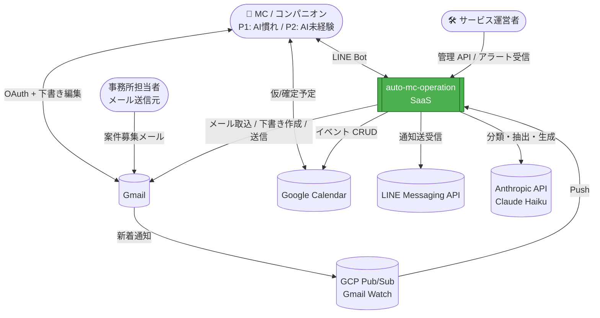
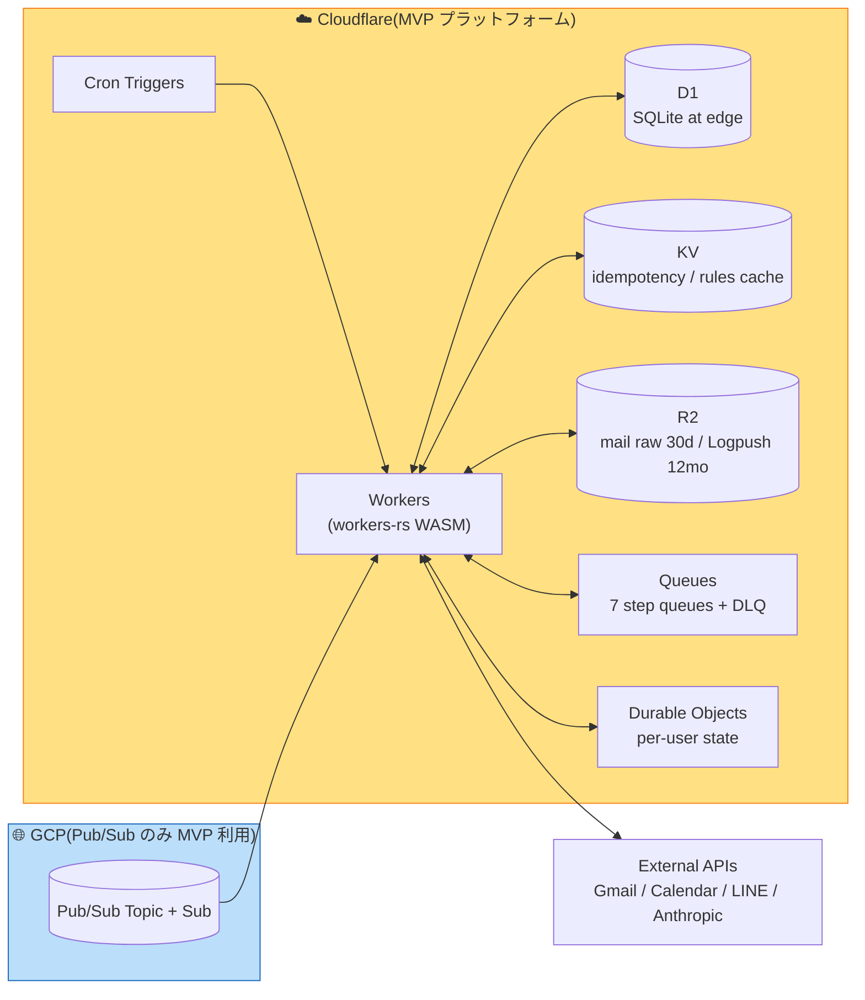
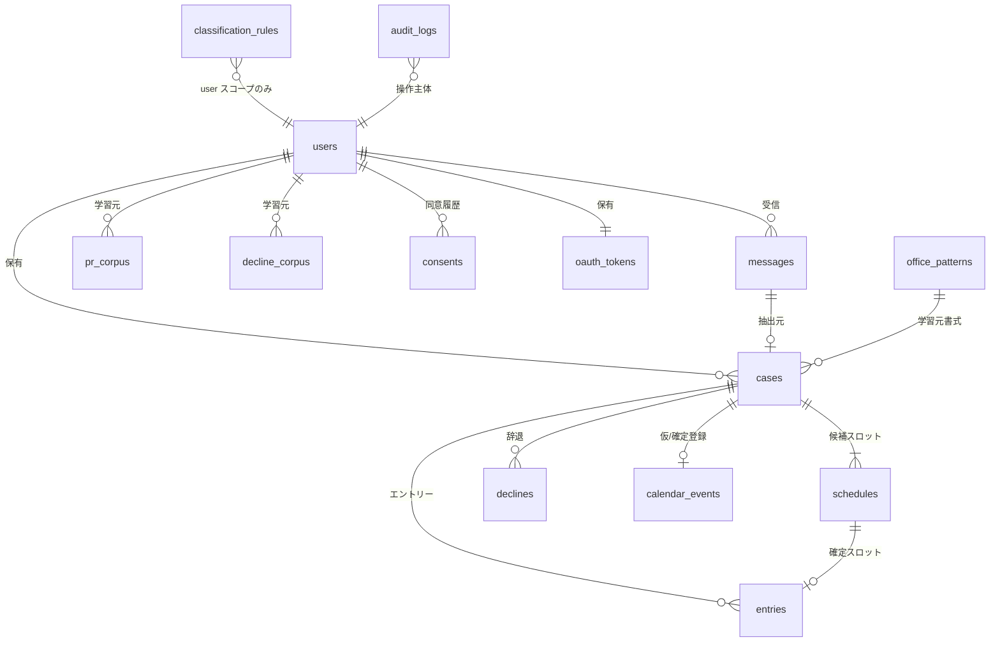

# Application Design — auto-mc-operation(統合ドキュメント)

本ドキュメントは Application Design ステージの **主成果物**。`components.md` / `component-methods.md` / `services.md` / `component-dependency.md` の内容をまとめ、**データモデル(D1 スキーマ)** と **API エンドポイント設計** を加えた完全版。

## 0. 設計原則(Plan セクション 3 の回答に準拠)

- **Q1 = B**: コンポーネント粒度は中粒度、ユニットに合わせて柔軟調整、過細化避ける(全 51、実質抽象 30)
- **Q2 = A**: 非同期通信は **ステップ別 Queue**(7 Queue + DLQ)
- **Q3 = C**: エラー型は **U2-EC-04 共通失敗ハンドリング 4 カテゴリ**(`Transient` / `Recoverable` / `DataIssue` / `Permanent`)を最上位、ドメイン別をネスト
- **Q4 = C**: API エンドポイントは **完全仕様**(URL + メソッド + 認証ヘッダ + レート制限 + バージョニング)
- **Q5 = B**: D1 スキーマは **全列 + 制約 + 主要 IDX + マイグレーション順序**
- **Q6 = B**: 認証は **Webhook 署名検証 + 管理 API Bearer + 将来 LIFF + JWT**(段階的)
- **Q7 = A**: トランザクション境界は **eventually consistent / saga**
- **Q8 = A**: テストモック境界は **F-11 抽象化トレイト境界**

---

## 1. C4 モデル

**P2 ペルソナ(AI 未経験者)配慮の設計反映**:
すべてのユーザー向け文言(エラー / 認可失敗 / フォールバック動線)は **`shared::MessageCatalog`(S-2)** に集約する。エラー時には「次に何のボタンをタップすればよいか」を MessageCatalog から具体ガイドとして取得し、LINE Flex Message に埋め込む(`personas.md` P2 の「専門用語ゼロ・具体ガイド必須」要件への準拠、F-08 メッセージング規約の延長)。

### 1.1 Context Diagram(システム全体と外部関係)



### 1.2 Container Diagram(Cloudflare 配置)



### 1.3 Component Diagram

`component-dependency.md` セクション 1 を参照。DDD 5 レイヤと依存方向(presentation → application → domain ← infrastructure)を厳守、`cargo deny` で機械的検証。

---

## 2. コンポーネント概要

詳細は `components.md` を参照。サマリ:

| レイヤ | crate | 主要コンポーネント数 | 役割 |
|--------|-------|---------------------|------|
| domain | `crates/domain` | 19 | 純粋なビジネスロジック・トレイト・エラー型(外部依存ゼロ) |
| application | `crates/application` | 10(ユースケース) | オーケストレーション、saga、補償 |
| infrastructure | `crates/infrastructure` | 11 | 外部 API / DB / Queue / 暗号 アダプタ |
| presentation | `crates/presentation` | 7 | Workers ハンドラ |
| shared | `crates/shared` | 4 | ロガー / メッセージ / エラー分類 / テスト支援 |

メソッドシグネチャは `component-methods.md`、依存関係は `component-dependency.md`、サービス層オーケストレーションは `services.md`。

---

## 3. データモデル(D1 スキーマ)

Q5 = B により全列 + 制約 + 主要 IDX + マイグレーション順序を明記。

### 3.1 ER 図



### 3.2 マイグレーション順序

```
0001_init_users_consents_oauth.sql       -- ユーザー基盤(他テーブルの FK 元)
0002_init_messages_office_patterns.sql   -- メール取込基盤
0003_init_classification_rules.sql       -- 分類ルール基盤
0004_init_cases_schedules.sql            -- 案件・スロット
0005_init_entries_drafts.sql             -- エントリー
0006_init_declines.sql                   -- 辞退
0007_init_calendar_events.sql            -- カレンダー連携
0008_init_corpus.sql                     -- PR文・辞退文学習データ
0009_init_audit_logs.sql                 -- 監査
0010_indexes_extra.sql                   -- 追加インデックス
```

### 3.3 主要テーブル定義

> `created_at` / `updated_at` は全テーブルに `TEXT NOT NULL DEFAULT (datetime('now'))`。`id` は `TEXT PRIMARY KEY`(UUID v7)。

```sql
-- 0001 users
CREATE TABLE users (
    id TEXT PRIMARY KEY,
    line_user_id TEXT NOT NULL UNIQUE,
    google_email TEXT NOT NULL,
    display_name TEXT,
    consent_version TEXT NOT NULL DEFAULT 'v1',
    travel_buffer_minutes INTEGER NOT NULL DEFAULT 60,  -- F-3 移動時間バッファ(設定可能)
    created_at TEXT NOT NULL DEFAULT (datetime('now')),
    updated_at TEXT NOT NULL DEFAULT (datetime('now'))
);
CREATE UNIQUE INDEX idx_users_line ON users(line_user_id);

-- 0001 oauth_tokens(F-09 暗号化、key_id は独立カラムで管理)
-- W6 修正: BLOB 内に key_id プレフィックスを含めず、独立カラム key_id を信頼の単一情報源とする
--           (検索効率と冗長排除のため (a) 案を採用)
CREATE TABLE oauth_tokens (
    user_id TEXT PRIMARY KEY REFERENCES users(id) ON DELETE CASCADE,
    encrypted_refresh_token BLOB NOT NULL,   -- {nonce}:{ct+tag}(key_id は別カラム)
    key_id TEXT NOT NULL,                    -- 復号鍵世代の識別子(F-09 ローテーション対応)
    scope TEXT NOT NULL,                     -- "gmail.modify gmail.send calendar.events"
    expires_at TEXT,
    last_refreshed_at TEXT,
    created_at TEXT NOT NULL DEFAULT (datetime('now')),
    updated_at TEXT NOT NULL DEFAULT (datetime('now'))
);

-- 0001 consents(同意履歴、改竄防止のため append-only)
-- W7 修正: SQLite には append-only 制約がないため、UPDATE/DELETE をトリガーで拒否
CREATE TABLE consents (
    id TEXT PRIMARY KEY,
    user_id TEXT NOT NULL REFERENCES users(id),
    version TEXT NOT NULL,
    agreed_at TEXT NOT NULL,
    ip_hash TEXT,
    user_agent_hash TEXT,
    created_at TEXT NOT NULL DEFAULT (datetime('now'))
);
CREATE INDEX idx_consents_user ON consents(user_id, agreed_at);

-- append-only を機械的に保証するトリガー(NFR-4 SECURITY-11 監査要件)
CREATE TRIGGER trg_consents_no_update BEFORE UPDATE ON consents
BEGIN SELECT RAISE(ABORT, 'consents is append-only'); END;
CREATE TRIGGER trg_consents_no_delete BEFORE DELETE ON consents
BEGIN SELECT RAISE(ABORT, 'consents is append-only'); END;

-- 0002 messages(取込メールメタ、本文は R2)
CREATE TABLE messages (
    id TEXT PRIMARY KEY,                     -- our id
    user_id TEXT NOT NULL REFERENCES users(id),
    gmail_message_id TEXT NOT NULL,
    gmail_thread_id TEXT NOT NULL,
    history_id TEXT NOT NULL,
    sender_domain TEXT NOT NULL,
    subject TEXT,
    received_at TEXT NOT NULL,
    classification TEXT,                     -- recruitment | decision | other | NULL(未分類)
    classified_by TEXT,                      -- rule | llm | NULL
    classification_confidence REAL,
    needs_review INTEGER NOT NULL DEFAULT 0,
    raw_blob_key TEXT,                       -- R2 のキー(30日で自動削除)
    raw_expires_at TEXT,
    created_at TEXT NOT NULL DEFAULT (datetime('now')),
    updated_at TEXT NOT NULL DEFAULT (datetime('now'))
);
CREATE UNIQUE INDEX idx_messages_gmail ON messages(user_id, gmail_message_id);
CREATE INDEX idx_messages_review ON messages(user_id, needs_review) WHERE needs_review = 1;

-- 0002 office_patterns
CREATE TABLE office_patterns (
    id TEXT PRIMARY KEY,
    sender_domain TEXT NOT NULL UNIQUE,
    office_name TEXT,
    pattern_data TEXT NOT NULL,              -- JSON: {sample_layouts, keywords, ...}
    success_count INTEGER NOT NULL DEFAULT 0,
    last_seen_at TEXT,
    created_at TEXT NOT NULL DEFAULT (datetime('now')),
    updated_at TEXT NOT NULL DEFAULT (datetime('now'))
);

-- 0003 classification_rules
CREATE TABLE classification_rules (
    id TEXT PRIMARY KEY,
    scope TEXT NOT NULL,                     -- 'global' | 'user'
    user_id TEXT REFERENCES users(id),       -- scope='user' のときのみ
    sender_domain_pattern TEXT,
    subject_keywords_json TEXT,
    body_keywords_any_json TEXT,
    body_keywords_all_json TEXT,
    target_label TEXT NOT NULL,
    priority INTEGER NOT NULL DEFAULT 50,
    enabled INTEGER NOT NULL DEFAULT 1,
    created_at TEXT NOT NULL DEFAULT (datetime('now')),
    updated_at TEXT NOT NULL DEFAULT (datetime('now'))
);
CREATE INDEX idx_rules_scope ON classification_rules(scope, user_id, enabled, priority);

-- 0004 cases
CREATE TABLE cases (
    id TEXT PRIMARY KEY,
    user_id TEXT NOT NULL REFERENCES users(id),
    source_message_id TEXT NOT NULL REFERENCES messages(id),
    office_id TEXT REFERENCES office_patterns(id) ON DELETE SET NULL,  -- W8 修正: 明示的 FK
    office_name TEXT NOT NULL,
    subject_name TEXT NOT NULL,
    location TEXT,
    compensation_text TEXT,
    compensation_amount INTEGER,             -- 抽出できた場合のみ
    deadline_at TEXT,
    pr_required INTEGER NOT NULL DEFAULT 0,
    other_conditions TEXT,
    extraction_warnings_json TEXT,           -- 欠落項目リスト
    status TEXT NOT NULL DEFAULT 'pending',  -- pending | entered | confirmed | declined
    created_at TEXT NOT NULL DEFAULT (datetime('now')),
    updated_at TEXT NOT NULL DEFAULT (datetime('now'))
);
CREATE INDEX idx_cases_user_status ON cases(user_id, status, deadline_at);
CREATE INDEX idx_cases_user_office ON cases(user_id, office_name);

-- 0004 schedules
CREATE TABLE schedules (
    id TEXT PRIMARY KEY,
    case_id TEXT NOT NULL REFERENCES cases(id) ON DELETE CASCADE,
    start_at TEXT NOT NULL,
    end_at TEXT,
    tz TEXT NOT NULL DEFAULT 'Asia/Tokyo',
    raw_text TEXT,
    confidence REAL NOT NULL DEFAULT 1.0,
    overlap_status TEXT,                     -- 最終判定: free | partial | full
    is_chosen INTEGER NOT NULL DEFAULT 0,    -- 確定後 1 つだけ 1
    created_at TEXT NOT NULL DEFAULT (datetime('now'))
);
CREATE INDEX idx_schedules_case ON schedules(case_id);
CREATE INDEX idx_schedules_time ON schedules(start_at, end_at);

-- 0005 entries
CREATE TABLE entries (
    id TEXT PRIMARY KEY,
    case_id TEXT NOT NULL REFERENCES cases(id),
    chosen_schedule_id TEXT REFERENCES schedules(id),
    draft_id TEXT,                           -- Gmail draft id
    pr_used INTEGER NOT NULL DEFAULT 0,
    submitted_at TEXT,                       -- ユーザー送信時刻(ユーザー操作)
    confirmed_at TEXT,
    status TEXT NOT NULL DEFAULT 'pending',  -- pending | submitted | confirmed | declined
    created_at TEXT NOT NULL DEFAULT (datetime('now')),
    updated_at TEXT NOT NULL DEFAULT (datetime('now'))
);
CREATE INDEX idx_entries_case ON entries(case_id);
CREATE INDEX idx_entries_status ON entries(status);

-- 0006 declines
CREATE TABLE declines (
    id TEXT PRIMARY KEY,
    case_id TEXT NOT NULL REFERENCES cases(id),
    triggered_by_case TEXT NOT NULL REFERENCES cases(id),  -- 決定案件
    decline_draft TEXT NOT NULL,             -- 生成された辞退本文
    sent_message_id TEXT,
    status TEXT NOT NULL DEFAULT 'proposed', -- proposed | sent | failed
    sent_at TEXT,
    created_at TEXT NOT NULL DEFAULT (datetime('now')),
    updated_at TEXT NOT NULL DEFAULT (datetime('now'))
);
CREATE INDEX idx_declines_case ON declines(case_id);

-- 0007 calendar_events
CREATE TABLE calendar_events (
    id TEXT PRIMARY KEY,
    user_id TEXT NOT NULL REFERENCES users(id),
    case_id TEXT NOT NULL REFERENCES cases(id),
    schedule_id TEXT NOT NULL REFERENCES schedules(id),
    google_event_id TEXT NOT NULL,
    state TEXT NOT NULL,                     -- tentative | confirmed | deleted
    created_at TEXT NOT NULL DEFAULT (datetime('now')),
    updated_at TEXT NOT NULL DEFAULT (datetime('now'))
);
CREATE INDEX idx_calevents_case ON calendar_events(case_id);
CREATE INDEX idx_calevents_user ON calendar_events(user_id, state);

-- 0008 pr_corpus / decline_corpus(本人帰属、永続)
CREATE TABLE pr_corpus (
    id TEXT PRIMARY KEY,
    user_id TEXT NOT NULL REFERENCES users(id),
    source_message_id TEXT,
    body TEXT NOT NULL,
    office_name TEXT,
    case_kind TEXT,                          -- "MC" | "コンパニオン" 等の推定
    char_length INTEGER NOT NULL,
    created_at TEXT NOT NULL DEFAULT (datetime('now'))
);
CREATE INDEX idx_pr_user_office ON pr_corpus(user_id, office_name);

CREATE TABLE decline_corpus (
    id TEXT PRIMARY KEY,
    user_id TEXT NOT NULL REFERENCES users(id),
    source_message_id TEXT,
    body TEXT NOT NULL,
    office_name TEXT,
    char_length INTEGER NOT NULL,
    created_at TEXT NOT NULL DEFAULT (datetime('now'))
);
CREATE INDEX idx_decline_user_office ON decline_corpus(user_id, office_name);

-- 0009 audit_logs
CREATE TABLE audit_logs (
    id TEXT PRIMARY KEY,
    user_id TEXT,                            -- system 操作のときは NULL
    actor TEXT NOT NULL,                     -- 'user:{id}' | 'system' | 'admin:{id}'
    action_source TEXT NOT NULL,             -- 'line_postback' | 'cron' | 'pubsub_push' | 'admin_api' | 'internal'
    action TEXT NOT NULL,                    -- e.g. 'classify_mail.success' | 'decline.send.failed'
    target_kind TEXT,                        -- 'message' | 'case' | 'entry' | 'decline' | ...
    target_id TEXT,
    payload_json TEXT,
    result TEXT NOT NULL,                    -- 'ok' | 'error'
    error_kind TEXT,                         -- 'transient' | 'recoverable' | 'data_issue' | 'permanent' | NULL
    correlation_id TEXT,
    created_at TEXT NOT NULL DEFAULT (datetime('now'))
);
CREATE INDEX idx_audit_user_time ON audit_logs(user_id, created_at);
CREATE INDEX idx_audit_action ON audit_logs(action, created_at);
```

---

## 4. API エンドポイント設計(Q4 = C 完全仕様)

### 4.1 URL 体系・バージョニング

- ベース URL: `https://api.<base-domain>`(production)/ `https://staging.<base-domain>`(staging)
- `<base-domain>` の実値は **F-10(ドメイン取得・DNS 設定)で確定** する(本ドキュメント時点ではプレースホルダ)
- バージョニングは **URL プレフィックス**: `/v1/` を全エンドポイントに付与(MVP は v1 のみ、breaking change 時に `/v2/`)
- Webhook は `/webhook/...`(バージョンなし、外部サービスの仕様に追従)

### 4.2 認証(Q6 = B 段階的)

| エンドポイント種別 | 認証方式 | 詳細 |
|------------------|---------|------|
| **公開 Webhook** | 署名検証 | LINE: `X-Line-Signature`(HMAC-SHA256) / GCP Pub/Sub: JWT(Google が署名)/ OAuth Callback: `state` パラメータ(CSRF 対策 + 開始リクエスト紐付け、有効期間付き、サーバー側 KV で照合) |
| **管理 API** | Bearer トークン | `Authorization: Bearer <token>`、トークンは Wrangler secrets で管理、IP 許可リスト併用、**`user_id` パラメータの権限チェック必須**(運用者ミスによる他ユーザーデータ操作を防止 / SECURITY-08 BOLA 防止) |
| **ユーザー API** | (Phase 2) JWT | LIFF + JWT、IDOR 防止のため `user_id` をトークンクレームから取得し、リソース所有確認(SECURITY-08) |

### 4.3 レート制限

| 種別 | 制限 | 実装 |
|------|------|------|
| LINE Webhook | LINE 側準拠(120 req/min/bot) | バーストは Queues で吸収 |
| Pub/Sub | Google 側準拠 | 同上 |
| 管理 API | 60 req/min/token | KV カウンタ |
| ユーザー API(Phase 2) | 30 req/min/user | Durable Object でユーザー毎カウンタ |
| 外部 API への発信(Anthropic / Google / LINE) | 各サービスのクォータ準拠 | Queues + 指数バックオフ |

**LLM 呼び出し設計目標(NFR-7「月額 500 円/ユーザー」達成のため)**:
- **目標上限: ≤ 4 回 / 案件**(分類 1 + 抽出 1 + PR 文生成 0〜1 + 辞退文生成 0〜1)
- 1 ユーザー × 月 600 案件相当(20 件/日 × 30 日)を想定すると、**最大 2400 回 / ユーザー / 月**
- ルールベース分類のヒット率を上げて分類 1 回を削減、プロンプトキャッシュで入力トークン削減、Few-shot 例の精選で出力トークン削減
- 詳細なトークン単価試算と閾値は **Functional Design ステージ(per-unit, Construction)** で確定

### 4.4 エンドポイント一覧

| URL | Method | 認証 | レート | リクエスト | レスポンス | 担当 Handler |
|-----|--------|------|--------|----------|----------|-------------|
| `/webhook/line` | POST | LINE 署名 | LINE 仕様 | LINE Event | 200 (空) | P-1 |
| `/webhook/pubsub` | POST | Pub/Sub JWT | — | `{message: {data, attributes}}` | 204 | P-2 |
| `/oauth/start` | GET | — | — | `?line_user_id=` | 302 → Google OAuth | P-4 |
| `/oauth/callback` | GET | state 検証 | — | `?code=&state=` | 200 完了画面(LINE 戻りボタン) | P-3 |
| `/v1/admin/dlq/{queue}/replay` | POST | Bearer | 60/min | `{message_ids: []}` | 200 `{replayed_count}` | P-7 |
| `/v1/admin/metrics` | GET | Bearer | 60/min | — | 200 メトリクス JSON | P-7 |
| `/v1/admin/rules` | GET / POST / PUT / DELETE | Bearer | 60/min | rule JSON | 200 | P-7 |
| `/v1/admin/users/{id}/reauth` | POST | Bearer | 60/min | — | 200 `{reauth_url}` | P-7 |

### 4.5 Webhook ペイロード受信時の冪等性

すべての Webhook ハンドラは:
1. リクエスト ID を計算(LINE: webhook event id / Pub/Sub: message id)
2. KV `idempotency:{kind}:{id}` を確認
3. 既処理ならスキップ、未処理なら 24 時間有効でマーク + 処理開始

---

## 5. エラーハンドリングアーキテクチャ(Q3 = C)

### 5.1 エラー型階層

```rust
#[derive(thiserror::Error, Debug)]
pub enum DomainError {
    #[error("transient: {source:?}")]
    Transient { source: TransientCause, retryable: bool },

    #[error("recoverable: requires user action {action:?}")]
    Recoverable { action: UserAction, message_key: MessageKey },

    #[error("data issue at field {field}: {raw_value:?}")]
    DataIssue { field: &'static str, raw_value: Option<String> },

    #[error("permanent: {reason}")]
    Permanent { reason: String, audit_required: bool },
}

pub enum TransientCause {
    UpstreamTimeout(ServiceName),
    RateLimited(ServiceName),
    NetworkError(String),
    DatabaseLocked,
}

pub enum UserAction {
    ReauthGoogle,
    ReauthLine,
    ReviewMessage(MessageId),
    ApproveDecline(Vec<DraftId>),
}
```

### 5.2 カテゴリ別ハンドリング

| カテゴリ | Queue 動作 | LINE 通知 | 監査ログ | 例 |
|---------|-----------|----------|---------|-----|
| Transient | 自動リトライ(3 回 / 指数バックオフ)→ 失敗時 DLQ | 連続失敗時のみ運用者通知 | `error_kind=transient` | LLM タイムアウト、API レート制限 |
| Recoverable | 即時 DLQ なし、`needs_user_action` フラグ立て | ユーザーに復旧ボタン送付 | `error_kind=recoverable` | OAuth 失効 |
| DataIssue | リトライしない、`needs_review` フラグ立て | ユーザーに原文確認依頼 | `error_kind=data_issue` | 必須項目欠落 |
| Permanent | 即時 DLQ + 運用者通知 | 控えめ(混乱回避) | `error_kind=permanent`, `audit_required=true` | プロンプト不備、仕様外メール |

### 5.3 失敗復旧フロー(`docs/operations.md` 連携)

`U2-EC-04 AC-3` で言及。各カテゴリの「アラート種別 → 確認手順 → 復旧コマンド」を明文化。

---

## 6. テスト戦略との接続

- **F-13 + Q8 = A**: ドメインポート(`MailRepository` / `CalendarRepository` / `NotificationChannel` / `LlmClient`)に対するモックを `crates/shared/test_support` に集約
- **PBT 対象**:
  - `OverlapDetector::check`(`proptest` で乱数生成した時間範囲の対称性・推移性)
  - シリアライズ往復(`Case`/`Schedule`/`Entry` の JSON ↔ Rust 型)
  - CSV エンコード(Phase 2 で復活時)
- **ゴールデンセット**: `tests/fixtures/extraction/` に βテスター由来の匿名化メール 30〜100 件、F1 スコア閾値 0.85 以上

---

## 7. 構成方針との整合性

| 構成方針 | 反映先 |
|---------|--------|
| 拡張性方針(F-11) | D-15〜D-18 ポートが Outlook / Apple Calendar / Slack 拡張時に新規アダプタ実装で対応 |
| ドキュメント集約方針 | `docs/architecture.md`(本ドキュメントの要約)/ `docs/api-design.md`(セクション 4 抜粋)/ `docs/data-model.md`(セクション 3 抜粋) |
| システム構成図(F-12) | セクション 1.1 / 1.2 がその実体、`docs/system-overview.md` に複製 |
| テスト・監視のスコープ(F-13/F-14) | 本ドキュメントは枠組みまで、詳細は Functional Design / Build and Test |

---

## 7.1 レビュー反映履歴(PR #3 issue #4365084235 / 2026-05-03)

レビュー結果を以下のように反映:

| 項目 | 対応 |
|------|------|
| **C1**: A-3(decision)流れ先 3 説 | `services.md` で `notify_queue` + `calendar_queue` の **両 enqueue 方針** に統一、シーケンス図と Queue 構成表を一致 |
| **C2**: 存在しない F-15 参照 | `components.md` の F-15 → F-13 に修正 |
| **C3**: A-10 RotateGmailWatch 設計片手落ち | `component-methods.md` にシグネチャ追加、`component-dependency.md` 依存マトリクスに行追加、`services.md` に Cron 起動シーケンス追加 |
| **W4**: コンポーネント数表記不一致 | `components.md` L3 を「約 51(実質抽象 30)」に修正、`application-design.md` と統一 |
| **W5**: A-9 NotifyUser CaseRepo 依存漏れ | 依存マトリクスに ✓ 追加(case_id を渡され Flex Message 用にサマリ取得する設計) |
| **W6**: oauth_tokens key_id 二重保存 | BLOB プレフィックスから `key_id` を除去、独立カラムを単一情報源に |
| **W7**: consents append-only 機械的保証なし | UPDATE/DELETE を拒否する SQLite トリガーを追加 |
| **W8**: cases.office_id FK 未宣言 | `REFERENCES office_patterns(id) ON DELETE SET NULL` を明示 |
| **S9**: state パラメータ説明 | 「`state`(CSRF 対策 + 開始紐付け、有効期間付き、KV 照合)」に整理 |
| **S10**: QueueEnvelope.retry_count 意図 | 「ステップ別 Queue 連鎖時の通算試行回数」用と注記 |
| **S11**: ベース URL F-10 参照 | `<base-domain>` の実値が F-10 で確定する旨を明記 |
| **S12**: Cloud Pub/Sub / GCP Pub/Sub 表記揺れ | 「GCP Pub/Sub」に統一 |
| **S13**: 管理 API BOLA 防止 | 4.2 認証表に `user_id` パラメータ権限チェック必須を明記 |
| **S14**: LLM 呼び出し回数上限 | 4.3 レート制限節に「≤ 4 回 / 案件、最大 2400 回 / ユーザー / 月」を設計目標として記載 |
| 上流ドキュメント(`requirements.md`)陳腐化 | F8 を Phase 2 へ移行注記、4.2 MVP 含めないものに追記、トレーサビリティ表 Q20 / FR-8 にも反映 |
| P2 ペルソナ反映 | セクション 1.0 に「ユーザー向け文言は `MessageCatalog`(S-2)集約、エラー時に具体ガイド埋め込み」を追記 |

## 8. 完了基準

本 Application Design ステージで以下が確定:

- ✅ 5 レイヤ・約 51 コンポーネントの責務とインターフェース
- ✅ 10 ユースケースのコマンド型・Result 型
- ✅ 7 ステップ別 Queue + DLQ + saga 補償パターン
- ✅ 13 D1 テーブルのスキーマ + 主要インデックス + マイグレーション順序
- ✅ Webhook / 管理 API / Phase 2 ユーザー API のエンドポイント仕様
- ✅ U2-EC-04 統合の 4 カテゴリエラー型階層

詳細な業務ロジック・閾値・タイムアウト値・バリデーションは **Functional Design ステージ(per-unit, Construction)** で確定する。
