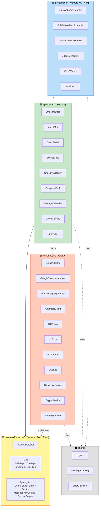

# Component Dependency — auto-mc-operation

依存関係マトリクスと通信パターン。**DDD の依存方向(presentation → application → domain ← infrastructure、shared は最下層)** を機械的に守る(F-01 AC-2)。

## 1. レイヤ間の依存方向(C4 Component 図)



**禁止依存(`cargo deny` / `cargo-modules` で CI 検出)**:
- ❌ `domain → infrastructure`(domain は外部依存ゼロ)
- ❌ `domain → application`(domain は最下層)
- ❌ `application → presentation`
- ❌ `presentation → infrastructure`(必ず application を経由)
- ❌ `infrastructure → presentation`

## 2. ユースケース → トレイトのマトリクス

各ユースケースが利用するドメイントレイト(各セルに ✓ がある = 依存):

| UseCase / Trait | UserRepo | CaseRepo | EntryRepo | DeclineRepo | MessageRepo | PrCorpus | DeclineCorpus | OfficePat | ClassRule | AuditLog | MailPort | CalPort | NotifPort | LlmPort | Crypto |
|-----------------|:----:|:----:|:----:|:----:|:----:|:----:|:----:|:----:|:----:|:----:|:----:|:----:|:----:|:----:|:----:|
| A-1 OnboardUser | ✓ |   |   |   |   |   |   |   |   | ✓ | ✓ |   |   |   | ✓ |
| A-2 IngestMail | ✓ |   |   |   | ✓ |   |   |   |   | ✓ | ✓ |   |   |   |   |
| A-3 ClassifyMail | ✓ |   |   |   | ✓ |   |   |   | ✓ | ✓ |   |   |   | ✓ |   |
| A-4 ExtractCase | ✓ | ✓ |   |   | ✓ |   |   | ✓ |   | ✓ |   |   |   | ✓ |   |
| A-5 CheckAvail | ✓ | ✓ |   |   |   |   |   |   |   | ✓ |   | ✓ |   |   |   |
| A-6 ComposeDraft | ✓ | ✓ | ✓ |   |   | ✓ |   | ✓ |   | ✓ | ✓ |   |   | ✓ |   |
| A-7 ManageCal | ✓ | ✓ | ✓ |   |   |   |   |   |   | ✓ |   | ✓ |   |   |   |
| A-8 DetectDecline | ✓ | ✓ | ✓ | ✓ |   |   | ✓ |   |   | ✓ | ✓ |   |   | ✓ |   |
| A-9 NotifyUser | ✓ |   |   |   |   |   |   |   |   | ✓ |   |   | ✓ |   |   |

## 3. 通信パターン

### 3.1 同期 vs 非同期

| 連携 | 種別 | チャネル |
|------|------|---------|
| `Presentation → Application`(HTTP リクエスト処理) | 同期 | 関数呼び出し |
| `Application → Application`(ユースケース間連携) | **非同期 9 割 + 同期 1 割** | 主に Queues、Postback 即時応答のみ同期 |
| `Application → Infrastructure(Repo)` | 同期 | DI 注入 + async 関数 |
| `Application → Infrastructure(外部 API)` | 同期(awaitable) | DI 注入 + async 関数(内部リトライ・タイムアウト管理) |
| `Infrastructure → External`(Gmail / Calendar / LINE / Anthropic) | 非同期(HTTP) | `reqwest` + `AbortSignal` |
| `Cron → Application` | 同期(Worker 起動) | scheduled handler |

### 3.2 メッセージ形式(Queue ペイロード)

すべての Queue メッセージは共通エンベロープ:

```rust
#[derive(Serialize, Deserialize)]
pub struct QueueEnvelope<T> {
    pub message_id: Uuid,
    pub correlation_id: Uuid,           // 同一フローの全メッセージ共通
    pub user_id: UserId,
    pub timestamp: DateTime<Utc>,
    pub idempotency_key: String,
    pub retry_count: u32,
    pub payload: T,
}
```

ペイロード型例:

```rust
pub enum ClassifyPayload   { New { message_id: MessageId } }
pub enum ExtractPayload    { Pending { message_id: MessageId, label: ClassificationLabel } }
pub enum AvailabilityPayload { Check { case_id: CaseId } }
pub enum DraftPayload      { Compose { case_id: CaseId, chosen_slot: SlotId, requires_pr: bool } }
pub enum NotifyPayload     { CaseSummary { case_id: CaseId } | DraftReady { case_id: CaseId, draft_id: DraftId } | DeclineProposal { proposals: Vec<DeclineDraft> } | Error { kind: ErrorKind, hint: MessageKey } }
pub enum CalendarPayload   { RegisterTentativeAll(CaseId) | PromoteAndCleanup { case_id: CaseId, slot_id: SlotId } | DeleteAll(CaseId) }
pub enum DeclinePayload    { Detect { confirmed_case: CaseId, confirmed_slot: SlotId } }
```

### 3.3 冪等性

- すべての Queue メッセージは `idempotency_key` を持つ(KV で重複検知)
- ユースケースは **冪等に書く**(同じ `idempotency_key` で 2 回呼ばれても結果同じ)
- HTTP ハンドラも冪等(Pub/Sub の at-least-once 配信に対応)

## 4. データ永続化マッピング

| ドメイン集約 | D1 テーブル | 暗号化 |
|-------------|-----------|--------|
| User | `users` | OAuth トークンのみ AES-GCM(F-09) |
| Case | `cases` | — |
| Schedule | `schedules`(`cases` に FK) | — |
| Entry | `entries`(`cases` / `schedules` に FK) | — |
| Decline | `declines`(`cases` に FK) | — |
| Message | `messages`(`users` に FK) | — |
| PrCorpus | `pr_corpus`(`users` に FK) | — |
| DeclineCorpus | `decline_corpus`(`users` に FK) | — |
| Consent | `consents`(`users` に FK) | — |
| OfficePattern | `office_patterns` | — |
| ClassificationRule | `classification_rules` + KV キャッシュ | — |
| AuditLog | `audit_logs` | — |

詳細スキーマは `application-design.md` のデータモデル節を参照。

## 5. 横断的関心事

| 関心事 | 適用箇所 |
|-------|---------|
| **構造化ログ** | すべてのレイヤで `Logger` 経由(F-06) |
| **エラー分類** | `application` レイヤで `ErrorClassifier` を通して U2-EC-04 4 カテゴリに振り分け |
| **メッセージ国際化** | `presentation` / `application` で `MessageCatalog` 経由(F-08) |
| **テストダブル** | `crates/shared/test_support` の Mock 実装(Q8=A) |
| **メトリクス** | `Logger` 内に `MetricsRecorder` を仕込み Workers Analytics Engine へ送信(F-14) |
| **リトライ** | `Queues` のリトライポリシー(infrastructure 層)+ ユースケース内のドメイン固有再試行 |

## 6. 主要シーケンス(エンドツーエンド フロー)

`services.md` の Saga 図参照。`A-2 → A-3 → A-4 → A-5 → A-6 → A-9 → (Postback) → A-7` がメインフロー。

決定後の補完フロー: `A-3(decision) → A-7 PromoteAndCleanup → A-8 DetectDecline → A-9 → (Postback) → A-8 send → A-7 DeleteAll(declined)`。
