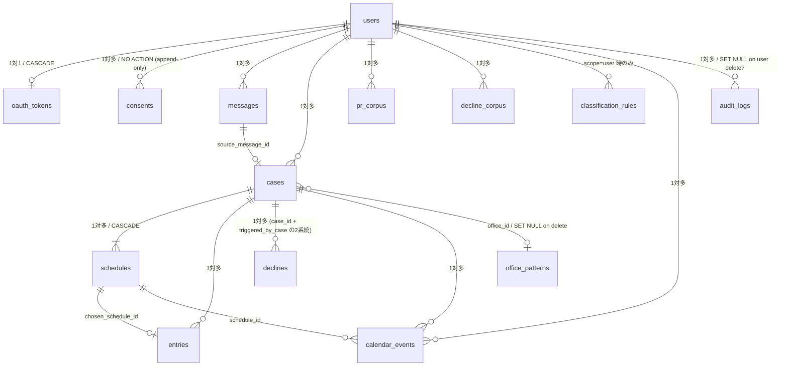

# Data Model — auto-mc-operation

> **📑 ID 参照**: 本ドキュメントは複数 ID を参照する。`A-N`(ユースケース)の **正本は `components.md` §2**、`F-NN`(Foundation Story)の正本は `inception/user-stories/stories.md`、`FR-N` / `NFR-N` は `inception/requirements/requirements.md`。横断 ID 一覧は `aidlc-docs/inception/id-index.md`。

D1(SQLite at edge)上の全 14 テーブルの詳細定義。各カラムの**目的・用途・どのユースケースが読み書きするか**を網羅。

このドキュメントは `application-design.md` Section 3 のデータモデル節を **詳細展開した独立資料** であり、Functional Design / Code Generation ステージで参照する一次情報源。

---

## 0. 設計原則

| 項目 | 方針 |
|------|------|
| 主キー | `id TEXT PRIMARY KEY` を **UUID v7**(時系列ソート可能、生成側 = アプリケーション層) |
| タイムスタンプ | `created_at` / `updated_at` を全テーブルに `TEXT NOT NULL DEFAULT (datetime('now'))`(ISO 8601 UTC) |
| 文字コード | UTF-8(SQLite デフォルト) |
| 外部キー | `PRAGMA foreign_keys = ON` 前提、すべて明示宣言 |
| 削除戦略 | 物理削除を基本。append-only(`consents` / `audit_logs`)はトリガーで保護 |
| 暗号化 | センシティブデータは **AES-256-GCM**(F-09)、`key_id` は別カラムで管理 |
| マイグレーション | 番号付きファイル(`migrations/0001_*.sql` 〜 `0010_*.sql`)、追加のみ・破壊的変更は `_replace.sql` 形式で対応 |

### テーブル一覧と所有ユースケース

| テーブル | 主用途 | 主な書き込み | 主な読み取り |
|---------|--------|-------------|-------------|
| `users` | ユーザーアカウント | A-1 OnboardUser | A-2〜A-10 全ユースケース |
| `oauth_tokens` | OAuth リフレッシュトークン保管(暗号化) | A-1 / A-10 | I-11 OAuth2Service |
| `consents` | プライバシーポリシー同意履歴 | A-1 | A-2(処理開始時の同意確認) |
| `messages` | 受信メールメタ | A-2 IngestMail | A-3 / A-4 / NeedsReview UI |
| `office_patterns` | 事務所別書式パターン学習 | A-4 ExtractCase | A-4(Few-shot 構築時) |
| `classification_rules` | ルールベース分類定義 | I-9 / 管理 API | A-3(全分類イベント) |
| `cases` | 案件マスタ | A-4 ExtractCase | A-5〜A-9 |
| `schedules` | 候補スロット(複数日程対応) | A-4 / A-7 | A-5 / A-7 / A-8 |
| `entries` | エントリー実績 | A-6 / 確定検出 | A-9 / Phase 2 CSV |
| `declines` | 辞退送信記録 | A-8 DetectAndDecline | 監査・運用 |
| `calendar_events` | サービス所有のカレンダーイベント追跡 | A-7 ManageCalendar | A-7(状態更新時) |
| `pr_corpus` | PR 文学習データ(本人作成、永続) | A-1 / 定期取込 | A-6 ComposeDraft |
| `decline_corpus` | 辞退文学習データ(本人作成、永続) | A-1 / 定期取込 | A-8 |
| `audit_logs` | 監査ログ | 全ユースケース | 運用・障害解析 |

---

## 1. `users` — ユーザーアカウント

**目的**: LINE ユーザー ID と Google アカウントを紐付け、ユーザー固有設定を保持する集約ルート。

| カラム | 型 | 制約 | 目的・用途 |
|--------|------|------|-----------|
| `id` | TEXT | PK / UUID v7 | 内部 ID。他テーブルから参照される FK 起点 |
| `line_user_id` | TEXT | NOT NULL UNIQUE | LINE Messaging API の Webhook で識別子として届く `userId`。LINE 公式アカウント友だち追加時に取得 |
| `google_email` | TEXT | NOT NULL | OAuth で連携した Gmail アドレス。表示用 + 監査用(他人のメールではないことの確認) |
| `display_name` | TEXT | NULL 可 | LINE プロフィール由来の表示名(任意、通知文の宛名等で利用) |
| `consent_version` | TEXT | NOT NULL DEFAULT 'v1' | 現在有効な同意ポリシー版。`consents.version` と一致を確認、ポリシー更新時に再同意を促す判定に使用 |
| `travel_buffer_minutes` | INTEGER | NOT NULL DEFAULT 60 | **FR-3** 移動時間バッファ(分)。ユーザー個別調整可。`OverlapDetector`(D-12)が利用 |
| `created_at` / `updated_at` | TEXT | NOT NULL | 作成・更新時刻 |

**インデックス**:
- `idx_users_line ON users(line_user_id)`(UNIQUE):LINE Webhook 受信時の最頻アクセス経路

**外部キー**: なし(他から参照される側)

**書き込み**: A-1 OnboardUser(初回作成、再認可時更新)
**読み取り**: A-2〜A-10 すべて(`user_id` を起点に他テーブルへ JOIN)

---

## 2. `oauth_tokens` — OAuth トークン保管(暗号化)

**目的**: Google OAuth のリフレッシュトークンを暗号化保管。F-09 の鍵世代管理で安全にローテーション可能。

| カラム | 型 | 制約 | 目的・用途 |
|--------|------|------|-----------|
| `user_id` | TEXT | PK / FK → `users(id)` ON DELETE CASCADE | ユーザー紐付け。1 ユーザー = 1 トークンレコード |
| `encrypted_refresh_token` | BLOB | NOT NULL | AES-256-GCM 暗号化されたリフレッシュトークン本体。フォーマット: `{nonce(12B)}:{ciphertext+tag}` |
| `key_id` | TEXT | NOT NULL | 暗号化に使った鍵世代の識別子(F-09 ローテーション対応)。復号時に該当世代の鍵を選択 |
| `scope` | TEXT | NOT NULL | 許可スコープ。例: `"gmail.modify gmail.send calendar.events"`。トークンが必要な権限を持つかの事前チェックに利用 |
| `expires_at` | TEXT | NULL 可 | アクセストークン(短命)の有効期限。リフレッシュトークン本体には期限が無いため通常 NULL |
| `last_refreshed_at` | TEXT | NULL 可 | 最後にアクセストークンをリフレッシュした時刻。長期未使用ユーザーの検知用 |
| `created_at` / `updated_at` | TEXT | NOT NULL | 作成・更新時刻 |

**インデックス**: PK のみ(全件アクセスは少なく、user_id 起点の単点取得が中心)

**書き込み**: A-1 OnboardUser(初回保存)、A-10 RotateGmailWatch(失効検知時更新トリガー)、I-11 OAuth2Service(リフレッシュ時)
**読み取り**: I-11 OAuth2Service(全外部 API 呼び出しの前提)

**セキュリティ**: 平文の `refresh_token` は **D1 内に存在しない**。NFR-4 SECURITY-01 / SECURITY-09 準拠。

---

## 3. `consents` — プライバシーポリシー同意履歴(append-only)

**目的**: 個情法・電気通信事業法対応のため、いつ・どの版のポリシーに同意したかを **改ざん不可で永続記録**。

| カラム | 型 | 制約 | 目的・用途 |
|--------|------|------|-----------|
| `id` | TEXT | PK / UUID v7 | 同意レコード ID |
| `user_id` | TEXT | NOT NULL FK → `users(id)` | 同意した本人 |
| `version` | TEXT | NOT NULL | 同意したポリシーの版数(例: `"v1"` / `"v2.1"`)。`users.consent_version` と一致しないユーザーは再同意を求める |
| `agreed_at` | TEXT | NOT NULL | ユーザーが同意ボタンを押した時刻(画面ローカルタイムでなく、サーバー受信時刻で正確に記録) |
| `ip_hash` | TEXT | NULL 可 | クライアント IP の SHA-256 ハッシュ。生 IP は保存しない(プライバシー)。同意取得時の **状況証拠**(否認防止)・運用上の異常検知の補助情報 |
| `created_at` | TEXT | NOT NULL | 作成時刻(`agreed_at` とほぼ同じだが DB 側基準) |

**インデックス**:
- `idx_consents_user ON consents(user_id, agreed_at)`:同意履歴の時系列取得

**append-only 強制**(W7 反映):
- `CREATE TRIGGER trg_consents_no_update BEFORE UPDATE ... RAISE(ABORT, ...)` で UPDATE を禁止
- `CREATE TRIGGER trg_consents_no_delete BEFORE DELETE ... RAISE(ABORT, ...)` で DELETE を禁止

**書き込み**: A-1 OnboardUser(初回 + 再同意時、INSERT のみ)
**読み取り**: A-2 IngestMail(処理開始時の同意確認)、運用(コンプライアンス監査)

---

## 4. `messages` — 受信メールメタ

**目的**: Gmail から取り込んだメールのメタ情報を保管。本文は短期(30 日)で R2 に置き、ここはメタ + 分類結果のみ保持。

| カラム | 型 | 制約 | 目的・用途 |
|--------|------|------|-----------|
| `id` | TEXT | PK / UUID v7 | サービス内 ID |
| `user_id` | TEXT | NOT NULL FK → `users(id)` | 所有者 |
| `gmail_message_id` | TEXT | NOT NULL | Gmail API のメッセージ ID。再取得や下書き返信時の `In-Reply-To` ヘッダで使用 |
| `gmail_thread_id` | TEXT | NOT NULL | Gmail スレッド ID。同じ案件のやり取りをまとめる際に使用 |
| `history_id` | TEXT | NOT NULL | Gmail History API の世代 ID。重複処理防止と差分取得に使用 |
| `sender_domain` | TEXT | NOT NULL | 送信元ドメイン(例: `office-a.example.com`)。ルールベース分類の最初のキー |
| `subject` | TEXT | NULL 可 | メール件名(分類・抽出ヒューリスティクス用) |
| `received_at` | TEXT | NOT NULL | メール受信時刻(Gmail 側) |
| `classification` | TEXT | NULL 可 | 分類結果。`recruitment` / `decision` / `other` / NULL(未分類) |
| `classified_by` | TEXT | NULL 可 | `rule`(ルールベース判定)/ `llm`(Haiku 判定)/ NULL。NFR-7 コスト分析(ルール率)に使用 |
| `classification_confidence` | REAL | NULL 可 | LLM 判定時の信頼度(0.0-1.0)。閾値未満は `needs_review = 1` |
| `needs_review` | INTEGER | NOT NULL DEFAULT 0 | 0/1。1 のメールは LINE で「原文確認してください」と通知 |
| `raw_blob_key` | TEXT | NULL 可 | R2 上の原文オブジェクトキー(例: `messages/{user_id}/{message_id}.eml`)。NULL は本文未保管(プリフィルタで弾いた等) |
| `raw_expires_at` | TEXT | NULL 可 | R2 オブジェクトの自動削除予定日時(NFR-5 30 日保管) |
| `created_at` / `updated_at` | TEXT | NOT NULL | 作成・更新時刻 |

**インデックス**:
- `idx_messages_gmail ON messages(user_id, gmail_message_id)`(UNIQUE):Push 通知の冪等性確認 / 重複取込防止
- `idx_messages_review ON messages(user_id, needs_review) WHERE needs_review = 1`:要確認メールの一覧画面用部分インデックス

**書き込み**: A-2 IngestMail(初回保存)、A-3 ClassifyMail(分類結果更新)
**読み取り**: A-3(分類対象抽出)、A-4 ExtractCase(本文取得)、運用(needs_review レビュー)

---

## 5. `office_patterns` — 事務所別書式パターン学習

**目的**: 各事務所のメール書式を蓄積し、抽出精度を上げる(Few-shot 例の元データ)。

| カラム | 型 | 制約 | 目的・用途 |
|--------|------|------|-----------|
| `id` | TEXT | PK / UUID v7 | パターン ID |
| `sender_domain` | TEXT | NOT NULL UNIQUE | 事務所のメール送信元ドメイン(同一事務所は 1 行) |
| `office_name` | TEXT | NULL 可 | 表示用事務所名(LLM 推定または手動登録) |
| `pattern_data` | TEXT | NOT NULL | JSON 文字列。サンプルレイアウト・特徴的キーワード・抽出済みフィールドの統計 |
| `success_count` | INTEGER | NOT NULL DEFAULT 0 | この事務所からのメールで抽出成功した件数。Few-shot 採用優先度に使用 |
| `last_seen_at` | TEXT | NULL 可 | 最終受信時刻。古いパターンの整理に使用 |
| `created_at` / `updated_at` | TEXT | NOT NULL | 作成・更新時刻 |

**インデックス**: PK + UNIQUE のみ(行数は事務所数 = 数十程度)

**書き込み**: A-4 ExtractCase(成功時にパターン更新)
**読み取り**: A-4(プロンプト構築時に Few-shot 例として参照)

---

## 6. `classification_rules` — ルールベース分類定義

**目的**: U1-02 第 1 段の判定ルールを **データとして外部化**(コードに直書きしない)、運用者が βテストに応じて追加・調整可能にする。

| カラム | 型 | 制約 | 目的・用途 |
|--------|------|------|-----------|
| `id` | TEXT | PK / UUID v7 | ルール ID |
| `scope` | TEXT | NOT NULL | `'global'`(全ユーザー共通)or `'user'`(ユーザー個別) |
| `user_id` | TEXT | NULL 可 FK → `users(id)` | `scope='user'` のときのみ NOT NULL |
| `sender_domain_pattern` | TEXT | NULL 可 | 正規表現または完全一致のパターン |
| `subject_keywords_json` | TEXT | NULL 可 | JSON 配列。`["募集"]` 等。AND マッチ |
| `body_keywords_any_json` | TEXT | NULL 可 | JSON 配列。OR マッチ(いずれか含めばヒット) |
| `body_keywords_all_json` | TEXT | NULL 可 | JSON 配列。AND マッチ(すべて含む必要) |
| `target_label` | TEXT | NOT NULL | ヒット時に付ける分類ラベル(`recruitment` / `decision` / `other`) |
| `priority` | INTEGER | NOT NULL DEFAULT 50 | ルール評価順。値が小さいほど先に評価(1 が最優先) |
| `enabled` | INTEGER | NOT NULL DEFAULT 1 | 0/1。一時無効化用 |
| `created_at` / `updated_at` | TEXT | NOT NULL | 作成・更新時刻 |

**インデックス**:
- `idx_rules_scope ON classification_rules(scope, user_id, enabled, priority)`:評価ループでの絞り込み + 順序

**書き込み**: I-9 ClassificationRuleEngine(運用者が管理 API 経由で CRUD)、A-3(自動拡張で `recruitment` 確定ドメインを `global` 候補に提示)
**読み取り**: A-3 ClassifyMail(全分類イベントで参照、KV にもキャッシュ)

---

## 7. `cases` — 案件マスタ(集約ルート)

**目的**: 抽出された案件 1 件を表す中核エンティティ。配下に `schedules` / `entries` / `declines` / `calendar_events` を持つ。

| カラム | 型 | 制約 | 目的・用途 |
|--------|------|------|-----------|
| `id` | TEXT | PK / UUID v7 | 案件 ID |
| `user_id` | TEXT | NOT NULL FK → `users(id)` | 所有者 |
| `source_message_id` | TEXT | NOT NULL FK → `messages(id)` | 抽出元メール |
| `office_id` | TEXT | NULL 可 FK → `office_patterns(id)` ON DELETE SET NULL | 既知事務所への紐付け。新規事務所は NULL のまま運用、後で OfficePattern 作成時に更新 |
| `office_name` | TEXT | NOT NULL | 事務所名(office_patterns 未登録でも案件は成立する) |
| `subject_name` | TEXT | NOT NULL | 案件名(イベント名・収録名等) |
| `location` | TEXT | NULL 可 | 場所文字列(住所・会場名)。抽出失敗時は NULL + warning |
| `compensation_text` | TEXT | NULL 可 | 報酬の生表記(例: `"1日 25,000 円(税込)"`、`"応相談"`) |
| `compensation_amount` | INTEGER | NULL 可 | パース可能な場合の数値(円)。Phase 2 CSV / 集計用 |
| `deadline_at` | TEXT | NULL 可 | エントリー締切(ISO 8601 UTC)。Cron で締切前リマインドに使用 |
| `pr_required` | INTEGER | NOT NULL DEFAULT 0 | 0/1。U2-EC-03 で判定。1 のとき A-6 が PR 文を Few-shot で生成 |
| `other_conditions` | TEXT | NULL 可 | 衣装・持ち物・年齢制限など自由記述条件 |
| `extraction_warnings_json` | TEXT | NULL 可 | 必須項目欠落時の警告内容(JSON) |
| `status` | TEXT | NOT NULL DEFAULT 'pending' | `pending` / `entered`(下書き作成済) / `confirmed`(決定) / `declined` / `expired`(締切超過) |
| `created_at` / `updated_at` | TEXT | NOT NULL | 作成・更新時刻 |

**インデックス**:
- `idx_cases_user_status ON cases(user_id, status, deadline_at)`:ステータス別一覧 + 締切順
- `idx_cases_user_office ON cases(user_id, office_name)`:同一事務所案件の検索

**書き込み**: A-4 ExtractCase(初回作成)、A-5 / A-6 / A-7 / A-8(`status` 更新)
**読み取り**: A-5〜A-9 全段階

---

## 8. `schedules` — 候補スロット(複数日程対応)

**目的**: U2-02 で定義した複数日程・複数時間枠を独立行で管理し、スロット単位で重複判定 / 確定 / 削除できる。

| カラム | 型 | 制約 | 目的・用途 |
|--------|------|------|-----------|
| `id` | TEXT | PK / UUID v7 | スロット ID(`slot_id` として外部から参照) |
| `case_id` | TEXT | NOT NULL FK → `cases(id)` ON DELETE CASCADE | 親案件。case 削除時に連動削除 |
| `start_at` | TEXT | NOT NULL | 開始日時(ISO 8601、`tz` で示すタイムゾーン) |
| `end_at` | TEXT | NULL 可 | 終了日時。NULL は終了未定スロット |
| `tz` | TEXT | NOT NULL DEFAULT 'Asia/Tokyo' | タイムゾーン(MVP は固定だが Phase 3 で拡張可能) |
| `raw_text` | TEXT | NULL 可 | メール本文中の元表現(抽出根拠保持、後の検証用) |
| `confidence` | REAL | NOT NULL DEFAULT 1.0 | LLM の抽出信頼度(0.0-1.0)。閾値未満は `needs_review` |
| `overlap_status` | TEXT | NULL 可 | 重複判定結果。`free` / `partial` / `full` / NULL(未判定) |
| `is_chosen` | INTEGER | NOT NULL DEFAULT 0 | 0/1。確定後 1 つだけ 1 になる(他は削除されるが履歴として 0 のまま残るケースあり) |
| `created_at` | TEXT | NOT NULL | 作成時刻(更新は通常しない) |

**インデックス**:
- `idx_schedules_case ON schedules(case_id)`:案件のスロット一覧取得
- `idx_schedules_time ON schedules(start_at, end_at)`:時間範囲検索(将来の月次集計等)

**書き込み**: A-4 ExtractCase(全候補登録)、A-5 CheckAvailability(`overlap_status` 更新)、A-7 ManageCalendar(`is_chosen` 更新)
**読み取り**: A-5 / A-7 / A-8 / 通知メッセージ生成時

---

## 9. `entries` — エントリー実績

**目的**: 案件にエントリー(下書き作成 → ユーザー送信)した記録。確定後の状態追跡 + Phase 2 の請求 CSV 出力源。

| カラム | 型 | 制約 | 目的・用途 |
|--------|------|------|-----------|
| `id` | TEXT | PK / UUID v7 | エントリー ID |
| `case_id` | TEXT | NOT NULL FK → `cases(id)` | 対象案件 |
| `chosen_schedule_id` | TEXT | NULL 可 FK → `schedules(id)` | エントリー時点で希望していたスロット(後で確定スロットになる場合あり) |
| `draft_id` | TEXT | NULL 可 | Gmail Draft ID。送信前のステータス確認に使用 |
| `pr_used` | INTEGER | NOT NULL DEFAULT 0 | 0/1。PR 文を含めたかどうか(運用統計用) |
| `submitted_at` | TEXT | NULL 可 | ユーザーが Gmail から実送信した時刻(ヒューリスティクスで検知) |
| `confirmed_at` | TEXT | NULL 可 | 決定連絡を受信した時刻 |
| `status` | TEXT | NOT NULL DEFAULT 'pending' | `pending`(下書き作成済)/ `submitted`(送信検知)/ `confirmed` / `declined` |
| `created_at` / `updated_at` | TEXT | NOT NULL | 作成・更新時刻 |

**インデックス**:
- `idx_entries_case ON entries(case_id)`:案件→エントリー
- `idx_entries_status ON entries(status)`:Phase 2 CSV エクスポート用

**書き込み**: A-6 ComposeDraft(初回作成)、A-3 / A-7(状態更新)
**読み取り**: A-9 通知時、Phase 2 CSV エクスポート

---

## 10. `declines` — 辞退送信記録

**目的**: 重複検出 → 辞退メール下書き → ユーザー承認 → 送信、の各段階を追跡。

| カラム | 型 | 制約 | 目的・用途 |
|--------|------|------|-----------|
| `id` | TEXT | PK / UUID v7 | 辞退レコード ID |
| `case_id` | TEXT | NOT NULL FK → `cases(id)` | 辞退する案件 |
| `triggered_by_case` | TEXT | NOT NULL FK → `cases(id)` | 辞退の原因となった決定案件(参照確認・統計用) |
| `decline_draft` | TEXT | NOT NULL | 生成された辞退本文(全文)。送信後も保管(本人の文体学習・監査) |
| `sent_message_id` | TEXT | NULL 可 | Gmail で送信した際のメッセージ ID |
| `status` | TEXT | NOT NULL DEFAULT 'proposed' | `proposed`(承認待ち)/ `approved` / `sent` / `failed` |
| `sent_at` | TEXT | NULL 可 | 実送信時刻 |
| `created_at` / `updated_at` | TEXT | NOT NULL | 作成・更新時刻 |

**インデックス**:
- `idx_declines_case ON declines(case_id)`:案件→辞退候補

**書き込み**: A-8 DetectAndDecline(`proposed`)、A-9 Postback(`approved`)、A-8 send(`sent`/`failed`)
**読み取り**: A-9(承認確認)、運用(辞退漏れチェック)

---

## 11. `calendar_events` — サービス所有のカレンダーイベント追跡

**目的**: 本サービスが Google カレンダーに作成した `[仮]` / `[確定]` イベントの状態を D1 側でも管理(プライベート予定との区別 / 一括削除のため)。

| カラム | 型 | 制約 | 目的・用途 |
|--------|------|------|-----------|
| `id` | TEXT | PK / UUID v7 | レコード ID |
| `user_id` | TEXT | NOT NULL FK → `users(id)` | 所有者 |
| `case_id` | TEXT | NOT NULL FK → `cases(id)` | 親案件 |
| `schedule_id` | TEXT | NOT NULL FK → `schedules(id)` | 元スロット |
| `google_event_id` | TEXT | NOT NULL | Google Calendar の eventId。後で更新・削除に使用 |
| `state` | TEXT | NOT NULL | `tentative`(`[仮]`)/ `confirmed`(`[確定]`)/ `deleted`(削除済、履歴保持) |
| `created_at` / `updated_at` | TEXT | NOT NULL | 作成・更新時刻 |

**インデックス**:
- `idx_calevents_case ON calendar_events(case_id)`:案件単位の一括操作
- `idx_calevents_user ON calendar_events(user_id, state)`:ユーザー全体での状態別取得

**書き込み**: A-7 ManageCalendar(全 CRUD)
**読み取り**: A-7(状態確認・削除対象抽出)、運用(整合性チェック)

---

## 12. `pr_corpus` — PR 文学習データ(本人作成、永続)

**目的**: ユーザーが過去に書いたエントリーメール本文を Few-shot 例として保管。**本人作成の文章 = 本人帰属、永続保管**(NFR-5)。

| カラム | 型 | 制約 | 目的・用途 |
|--------|------|------|-----------|
| `id` | TEXT | PK / UUID v7 | レコード ID |
| `user_id` | TEXT | NOT NULL FK → `users(id)` | 所有者 |
| `source_message_id` | TEXT | NULL 可 | 元の送信メッセージ ID(取り込み元の追跡) |
| `body` | TEXT | NOT NULL | PR 文本体(プレーンテキスト) |
| `office_name` | TEXT | NULL 可 | 宛先事務所(同一事務所別 Few-shot 採用優先度に使用) |
| `case_kind` | TEXT | NULL 可 | 推定案件種別(`"MC"` / `"コンパニオン"` / `"司会"` 等)。文体選択のヒント |
| `char_length` | INTEGER | NOT NULL | 本文文字数。短/中/長の長さ推定で利用 |
| `created_at` | TEXT | NOT NULL | 取込時刻 |

**インデックス**:
- `idx_pr_user_office ON pr_corpus(user_id, office_name)`:同一事務所宛 Few-shot 取得

**書き込み**: A-1 OnboardUser(初回 Sent フォルダから収集)、Cron(定期再収集)
**読み取り**: A-6 ComposeDraft(プロンプト Few-shot 構築)

---

## 13. `decline_corpus` — 辞退文学習データ(本人作成、永続)

**目的**: ユーザーが過去に書いた辞退メール本文を Few-shot 例として保管。U7-02 の辞退下書き生成精度を上げる。**本人作成 = 永続保管**。

| カラム | 型 | 制約 | 目的・用途 |
|--------|------|------|-----------|
| `id` | TEXT | PK / UUID v7 | レコード ID |
| `user_id` | TEXT | NOT NULL FK → `users(id)` | 所有者 |
| `source_message_id` | TEXT | NULL 可 | 元の送信メッセージ ID |
| `body` | TEXT | NOT NULL | 辞退文本体 |
| `office_name` | TEXT | NULL 可 | 宛先事務所(同一事務所別 Few-shot 優先) |
| `char_length` | INTEGER | NOT NULL | 本文文字数 |
| `created_at` | TEXT | NOT NULL | 取込時刻 |

**インデックス**:
- `idx_decline_user_office ON decline_corpus(user_id, office_name)`:同一事務所宛 Few-shot 取得

**書き込み**: A-1 OnboardUser(初回 Sent フォルダから「辞退/失礼ながら/お見送り」キーワードで収集)、Cron(定期)
**読み取り**: A-8 DetectAndDecline(辞退下書き生成時の Few-shot)

---

## 14. `audit_logs` — 監査ログ(append-only 同等)

**目的**: F-06 で定義された **`actor` / `action_source` を必須化した完全追跡**。NFR-5 で 12 ヶ月保管(古いものは Cron でアーカイブ → R2)。

| カラム | 型 | 制約 | 目的・用途 |
|--------|------|------|-----------|
| `id` | TEXT | PK / UUID v7 | ログ ID(時系列ソート) |
| `user_id` | TEXT | NULL 可 | 関連ユーザー(system 操作の場合 NULL) |
| `actor` | TEXT | NOT NULL | 操作者識別子。例: `"user:01HX..."` / `"system"` / `"admin:dev01"` |
| `action_source` | TEXT | NOT NULL | 起動経路。`line_postback` / `line_message` / `cron_trigger` / `pubsub_push` / `admin_api` / `internal` |
| `action` | TEXT | NOT NULL | アクション種別。例: `"classify_mail.success"` / `"decline.send.failed"` |
| `target_kind` | TEXT | NULL 可 | 対象オブジェクト種別。`message` / `case` / `entry` / `decline` / `calendar_event` / NULL |
| `target_id` | TEXT | NULL 可 | 対象オブジェクト ID |
| `payload_json` | TEXT | NULL 可 | コンテキスト情報(token 数 / classified_by / error 詳細など)。**シークレットを含めない**(F-06 マスキング) |
| `result` | TEXT | NOT NULL | `'ok'` / `'error'` |
| `error_kind` | TEXT | NULL 可 | エラー時の U2-EC-04 4 カテゴリ。`transient` / `recoverable` / `data_issue` / `permanent` / NULL |
| `correlation_id` | TEXT | NULL 可 | 同一リクエストフローの相関 ID(`QueueEnvelope.correlation_id` と同値) |
| `created_at` | TEXT | NOT NULL | 記録時刻 |

**インデックス**:
- `idx_audit_user_time ON audit_logs(user_id, created_at)`:ユーザー別タイムライン
- `idx_audit_action ON audit_logs(action, created_at)`:アクション種別ダッシュボード(F-14 監視)

**書き込み**: 全ユースケース(成功・失敗の両方)、F-06 Logger 経由
**読み取り**: 運用(障害解析)、F-14 メトリクス集計、コンプライアンス監査

**保管ポリシー**: 12 ヶ月で Cron が古いレコードを R2 にアーカイブ、D1 から削除(NFR-5)。アーカイブ済みデータは検索に時間がかかるが復元可能。

---

## 15. テーブル間の依存関係(削除カスケード視点)

**ユーザー削除時の挙動**:
- ユーザーがサービスを退会する際、関連するすべてのデータを物理削除する設計を MVP とする
- 例外: `audit_logs` は監査要件のため、`user_id` を NULL に更新して履歴は残す(コンプライアンス)
- `consents` は append-only のため削除不可。退会後は別途 `users.deleted_at` でソフトデリート扱いとする(MVP では物理削除、Phase 2 で再設計予定)

---

## 16. データ保存方針(NFR-5 準拠)

| データ種別 | 保管期間 | 該当テーブル / R2 |
|-----------|---------|-------------------|
| メール本文(原文) | 30 日 | R2(`raw_blob_key`)、`messages.raw_expires_at` で管理 |
| 構造化抽出データ | 24 ヶ月 | D1 全般(`messages` / `cases` / `schedules` / `entries` / `declines` / `calendar_events`) |
| PR 文学習データ | 永続 | D1 `pr_corpus` |
| 辞退文学習データ | 永続 | D1 `decline_corpus` |
| 同意履歴 | 永続(append-only) | D1 `consents` |
| 監査ログ | 12 ヶ月(D1)+ R2 アーカイブ | D1 `audit_logs` → R2 |
| OAuth トークン | ユーザー在籍期間中 | D1 `oauth_tokens`(暗号化) |

**Cron による削除/アーカイブ ジョブ**(F-14 / F-13 範囲):
- `r2-cleanup` (毎日): `messages.raw_expires_at < now()` の R2 オブジェクトを削除し `raw_blob_key = NULL` に更新
- `d1-archive-audit` (毎週): 12 ヶ月超の `audit_logs` を R2 にエクスポート → D1 から削除
- `d1-archive-extracted` (毎月): 24 ヶ月超の `messages` / `cases` / `schedules` / `entries` / `declines` を R2 にエクスポート → D1 から削除

---

## 17. 今後の拡張(Phase 2 以降の追加候補)

| テーブル | 用途 | 追加タイミング |
|---------|------|----------------|
| `tenants` | マルチテナント識別 | P2-01 マルチテナント認証 |
| `subscriptions` | Stripe 課金管理 | P2-03 課金システム |
| `webhook_outbox` | 信頼性向上のための Outbox パターン | スケール拡大時 |
| `mail_provider_accounts` | Outlook / IMAP 等の追加メール連携 | P2-05 |
| `calendar_provider_accounts` | Apple Calendar / Outlook Calendar 連携 | P2-06 |

各 Phase 2 拡張は既存テーブルに対して破壊的変更を起こさないよう、**新テーブルの追加 + 既存への optional FK 追加** を基本方針とする。

---

## 参考: SQL DDL 全体は `application-design.md` Section 3.3 を参照(マイグレーションファイルに分割される想定)。
