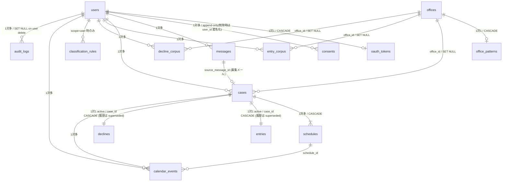

# Data Model — auto-mc-operation

> **📑 ID 参照**: 本ドキュメントは複数 ID を参照する。`A-N`(ユースケース)の **正本は `components.md` §2**、`F-NN`(Foundation Story)の正本は `inception/user-stories/stories.md`、`FR-N` / `NFR-N` は `inception/requirements/requirements.md`。横断 ID 一覧は `aidlc-docs/inception/id-index.md`。

D1(SQLite at edge)上の全 15 テーブルの詳細定義。各カラムの**目的・用途・どのユースケースが読み書きするか**を網羅。

このドキュメントは `application-design.md` Section 3 のデータモデル節を **詳細展開した独立資料** であり、Functional Design / Code Generation ステージで参照する一次情報源。

---

## 0. 設計原則

| 項目 | 方針 |
|------|------|
| 主キー | `id TEXT PRIMARY KEY` を **UUID v7**(時系列ソート可能、生成側 = アプリケーション層) |
| タイムスタンプ | `created_at` / `updated_at` を全テーブルに `TEXT NOT NULL DEFAULT (datetime('now'))`(ISO 8601 UTC) |
| 文字コード | UTF-8(SQLite デフォルト) |
| 外部キー | `PRAGMA foreign_keys = ON` 前提、すべて明示宣言 |
| 削除戦略 | 物理削除を基本。append-only(`consents` / `audit_logs`)はトリガーで保護 |
| 暗号化 | センシティブデータは **AES-256-GCM**(F-09)、`key_id` は別カラムで管理 |
| マイグレーション | 番号付きファイル(`migrations/0001_*.sql` 〜 `0010_*.sql`)、追加のみ・破壊的変更は `_replace.sql` 形式で対応 |

### スロット ID の命名規約(混乱防止)

候補スロット(`Schedule` エンティティ)の一意 ID は **役割ごとに命名を分ける**(無理に統一しない、文脈で意味を伝える):

| 文脈 | 命名 | 理由 |
|------|------|------|
| DB 物理カラム(PK) | `schedules.id` | テーブル PK の汎用命名規則 |
| DB 物理カラム(FK) | `*.schedule_id`(例: `calendar_events.schedule_id`) | テーブル FK の汎用命名規則(`<table>_id`) |
| ドメイン VO / Story 表記 | `slot_id` | 業務ドメインの語彙(「スロット」が募集メールの候補日に対する自然な呼称) |
| Use case コマンド型(**確定済み**スロット限定) | `chosen_slot: SlotId` | W2 修正(`application-design.md §7.2`)、「確定済み」の意味を型 + フィールド名で表現 |
| `OverlapStatus` enum バリアント | `slot_id` | ドメイン語彙ゆえ |

`SlotId` 型は `schedules.id` の TEXT(UUID v7)のラッパー。VO / Story の `slot_id` も同型で、コード生成時は VO ↔ DB 変換層で名前が切り替わる(認知負荷を変換層に局所化)。

### テーブル一覧と所有ユースケース

| テーブル | 主用途 | 主な書き込み | 主な読み取り |
|---------|--------|-------------|-------------|
| `users` | ユーザーアカウント | A-1 OnboardUser | A-2〜A-10 全ユースケース |
| `oauth_tokens` | OAuth リフレッシュトークン保管(暗号化) | A-1 / A-10 | I-11 OAuth2Service |
| `consents` | プライバシーポリシー同意履歴 | A-1 | A-2(処理開始時の同意確認) |
| `messages` | 受信メールメタ | A-2 IngestMail | A-3 / A-4 / NeedsReview UI |
| `offices` | 事務所マスタ(案件 / コーパスから参照) | A-4 ExtractCase / 管理 API | A-4 / A-6 / A-8 |
| `office_patterns` | 事務所別書式パターン学習 | A-4 ExtractCase | A-4(Few-shot 構築時) |
| `classification_rules` | ルールベース分類定義 | I-9 / 管理 API | A-3(全分類イベント) |
| `cases` | 案件マスタ | A-4 ExtractCase | A-5〜A-9 |
| `schedules` | 候補スロット(複数日程対応) | A-4 / A-7 | A-5 / A-7 / A-8 |
| `entries` | エントリー実績 | A-6 / 確定検出 | A-9 / `[Phase 2: P2-08]` 請求 CSV |
| `declines` | 辞退送信記録 | A-8 DetectAndDeclineConflicts | 監査・運用 |
| `calendar_events` | サービス所有のカレンダーイベント追跡 | A-7 ManageCalendar | A-7(状態更新時) |
| `entry_corpus` | エントリーメール文学習データ(本人作成、永続) | A-1 / 定期取込 | A-6 ComposeEntryDraft |
| `decline_corpus` | 辞退文学習データ(本人作成、永続) | A-1 / 定期取込 | A-8 |
| `audit_logs` | 監査ログ | 全ユースケース | 運用・障害解析 |

---

## 1. `users` — ユーザーアカウント

**目的**: LINE ユーザー ID と Google アカウントを紐付け、ユーザー固有設定を保持する集約ルート。

| カラム | 型 | 制約 | 目的・用途 |
|--------|------|------|-----------|
| `id` | TEXT | PK / UUID v7 | 内部 ID。他テーブルから参照される FK 起点 |
| `line_user_id` | TEXT | NOT NULL UNIQUE | LINE Messaging API の Webhook で識別子として届く `userId`。LINE 公式アカウント友だち追加時に取得 |
| `google_email` | TEXT | NOT NULL | OAuth で連携した Gmail アドレス。表示用 + 監査用(他人のメールではないことの確認) |
| `display_name` | TEXT | NULL 可 | LINE プロフィール由来の表示名(任意、通知文の宛名等で利用) |
| `consent_version` | TEXT | NOT NULL DEFAULT 'v1' | 現在有効な同意ポリシー版。`consents.version` と一致を確認、ポリシー更新時に再同意を促す判定に使用 |
| `travel_buffer_minutes` | INTEGER | NOT NULL DEFAULT 60 | **FR-3** 移動時間バッファ(分)。ユーザー個別調整可。`OverlapDetector`(D-12)が利用 |
| `deletion_started_at` | TEXT | NULL 可 | アカウント削除請求受付時刻。**NULL 以外の場合は削除処理中とみなし、全 Webhook / キュー処理を拒否**(§17.2 Step 0)。削除完了時に当該行が物理削除されるため通常は NULL |
| `created_at` / `updated_at` | TEXT | NOT NULL | 作成・更新時刻 |

**インデックス**:
- `idx_users_line ON users(line_user_id)`(UNIQUE):LINE Webhook 受信時の最頻アクセス経路

**外部キー**: なし(他から参照される側)

**書き込み**: A-1 OnboardUser(初回作成、再認可時更新)
**読み取り**: A-2〜A-10 すべて(`user_id` を起点に他テーブルへ JOIN)

---

## 2. `oauth_tokens` — OAuth トークン保管(暗号化)

**目的**: Google OAuth のリフレッシュトークンを暗号化保管。F-09 の鍵世代管理で安全にローテーション可能。

| カラム | 型 | 制約 | 目的・用途 |
|--------|------|------|-----------|
| `user_id` | TEXT | PK / FK → `users(id)` ON DELETE CASCADE | ユーザー紐付け。1 ユーザー = 1 トークンレコード |
| `encrypted_refresh_token` | BLOB | NOT NULL | AES-256-GCM 暗号化されたリフレッシュトークン本体。**バイナリ形式の固定長連結**: `nonce(12B) ‖ ciphertext ‖ tag(16B)`(`‖` は連結。区切り文字を使わずオフセットで分離 — `nonce = bytes[0..12]` / `ciphertext = bytes[12..len-16]` / `tag = bytes[len-16..]`)。ASCII 区切り文字(`:` 等)は nonce / ciphertext がバイト 0x3A を含み得るため使用しない |
| `key_id` | TEXT | NOT NULL | 暗号化に使った鍵世代の識別子(F-09 ローテーション対応)。**TEXT 型の理由**: 人間可読(`"v1"` / `"v2"` / `"key-2025-q1"` 等任意命名)+ 鍵命名規則の柔軟性確保のため。復号時に該当世代の鍵を選択 |
| `scope` | TEXT | NOT NULL | 許可スコープ。例: `"gmail.modify gmail.send calendar.events"`。トークンが必要な権限を持つかの事前チェックに利用 |
| `expires_at` | TEXT | NULL 可 | **アクセストークン(短命)の有効期限**。Google OAuth では access_token はリフレッシュ時に発行され、Gmail / Calendar API 呼び出しヘッダ(`Authorization: Bearer ...`)で使用される。通常 1 時間で失効するためリフレッシュトークンから都度再発行。**本カラムは access_token 自体ではなくその期限のみを保持**(access_token は短命のためメモリ保持で十分、永続化しない) |
| `last_refreshed_at` | TEXT | NULL 可 | 最後にアクセストークンをリフレッシュした時刻。長期未使用ユーザーの検知用 |
| `created_at` / `updated_at` | TEXT | NOT NULL | 作成・更新時刻 |

**インデックス**: PK のみ(全件アクセスは少なく、user_id 起点の単点取得が中心)

**書き込み**: A-1 OnboardUser(初回保存)、A-10 RotateGmailWatch(失効検知時更新トリガー)、I-11 OAuth2Service(リフレッシュ時)
**読み取り**: I-11 OAuth2Service(全外部 API 呼び出しの前提)

**セキュリティ**: 平文の `refresh_token` は **D1 内に存在しない**。NFR-4 SECURITY-01 / SECURITY-09 準拠。

---

## 3. `consents` — プライバシーポリシー同意履歴(append-only)

**目的**: 個情法・電気通信事業法対応のため、いつ・どの版のポリシーに同意したかを **改ざん不可で永続記録**。

| カラム | 型 | 制約 | 目的・用途 |
|--------|------|------|-----------|
| `id` | TEXT | PK / UUID v7 | 同意レコード ID |
| `user_id` | TEXT | NULL 可 FK → `users(id)` ON DELETE NO ACTION | 同意した本人。**通常 INSERT 時は NOT NULL 相当**(アプリケーション層で必須チェック)、**削除請求時のみ NULL 化を許可**(append-only トリガーをバイパスする削除専用ロジック、§17.3)。`version` / `agreed_at` は同意イベント証跡として残しつつ、本カラムを NULL 化することで個人特定不可状態にする |
| `version` | TEXT | NOT NULL | 同意したポリシーの版数(例: `"v1"` / `"v2.1"`)。`users.consent_version` と一致しないユーザーは再同意を求める |
| `agreed_at` | TEXT | NOT NULL | ユーザーが同意ボタンを押した時刻(画面ローカルタイムでなく、サーバー受信時刻で正確に記録) |
| `ip_hash` | TEXT | NULL 可 | クライアント IP の SHA-256 ハッシュ。生 IP は保存しない(プライバシー)。同意取得時の **状況証拠**(否認防止)・運用上の異常検知の補助情報 |
| `created_at` | TEXT | NOT NULL | 作成時刻(`agreed_at` とほぼ同じだが DB 側基準) |

**インデックス**:
- `idx_consents_user ON consents(user_id, agreed_at)`:同意履歴の時系列取得

**append-only 強制**(W7 反映、§17.3 アカウント削除と整合):
- `CREATE TRIGGER trg_consents_no_update BEFORE UPDATE ... WHEN <user_id NULL 化以外の変更>` で **`user_id` を NULL 化する UPDATE のみ許可**(削除請求時の匿名化)、それ以外の列(`version` / `agreed_at` / `ip_hash` / `created_at`)を書き換える UPDATE は `RAISE(ABORT, ...)`
- `CREATE TRIGGER trg_consents_no_delete BEFORE DELETE ... RAISE(ABORT, ...)` で DELETE を禁止(物理削除は不可、同意イベント証跡を必ず残す)

**書き込み**: A-1 OnboardUser(初回 + 再同意時、INSERT のみ)
**読み取り**: A-2 IngestMail(処理開始時の同意確認)、運用(コンプライアンス監査)

---

## 4. `messages` — 受信メールメタ

**目的**: Gmail から取り込んだメールのメタ情報を保管。本文は短期(30 日)で R2 に置き、ここはメタ + 分類結果のみ保持。

| カラム | 型 | 制約 | 目的・用途 |
|--------|------|------|-----------|
| `id` | TEXT | PK / UUID v7 | サービス内 ID |
| `user_id` | TEXT | NOT NULL FK → `users(id)` | 所有者 |
| `gmail_message_id` | TEXT | NOT NULL | Gmail API のメッセージ ID。再取得や下書き返信時の `In-Reply-To` ヘッダで使用 |
| `gmail_thread_id` | TEXT | NOT NULL | Gmail スレッド ID。同じ案件のやり取りをまとめる際に使用 |
| `history_id` | TEXT | NOT NULL | Gmail History API の世代 ID。重複処理防止と差分取得に使用 |
| `sender_domain` | TEXT | NOT NULL | 送信元ドメイン(例: `office-a.example.com`)。ルールベース分類の最初のキー |
| `subject` | TEXT | NULL 可 | メール件名(分類・抽出ヒューリスティクス用) |
| `received_at` | TEXT | NOT NULL | メール受信時刻(Gmail 側) |
| `classification` | TEXT | NULL 可 | 分類結果。`recruitment` / `decision` / `other` / NULL(未分類) |
| `classified_by` | TEXT | NULL 可 | `rule`(ルールベース判定)/ `llm`(Haiku 判定)/ NULL。NFR-7 コスト分析(ルール率)に使用 |
| `classification_confidence` | REAL | NULL 可 | LLM 判定時の信頼度(0.0-1.0)。閾値未満は `needs_review = 1`。**閾値変更時の方針**: 過去レコードは更新せず、変更後に分類されるメールから新閾値を適用(過去の `needs_review` は判定時の閾値での結果のスナップショット) |
| `needs_review` | INTEGER | NOT NULL DEFAULT 0 | 0/1 (SQLite には BOOLEAN 型がなく INTEGER 0/1 が公式推奨)。1 のメールは LINE で「原文確認してください」と通知 |
| `raw_blob_key` | TEXT | NULL 可 | R2 上の原文オブジェクトキー(例: `messages/{user_id}/{message_id}.eml`)。NULL は本文未保管(プリフィルタで弾いた等) |
| `raw_expires_at` | TEXT | NULL 可 | R2 オブジェクトの自動削除予定日時(NFR-5 30 日保管)。**DB カラムに持つ理由**: R2 のバケットライフサイクルは「全オブジェクト一律 N 日後削除」しか設定できず、ユーザーごとに登録時刻が異なる本サービスでは個別管理が必要 → D1 側でメッセージ単位の期限を管理し、Cron で `raw_expires_at < now()` の R2 オブジェクトを削除する |
| `created_at` / `updated_at` | TEXT | NOT NULL | 作成・更新時刻 |

**インデックス**:
- `idx_messages_gmail ON messages(user_id, gmail_message_id)`(UNIQUE):Push 通知の冪等性確認 / 重複取込防止
- `idx_messages_thread ON messages(user_id, gmail_thread_id)`:A-4 ExtractCase の同一スレッド検索(DB-M-03)
- `idx_messages_history ON messages(user_id, history_id)`(UNIQUE):Pub/Sub at-least-once 配信耐性(DB-M-09)
- `idx_messages_review ON messages(user_id, needs_review) WHERE needs_review = 1`:要確認メールの一覧画面用部分インデックス

**書き込み**: A-2 IngestMail(初回保存)、A-3 ClassifyMail(分類結果更新)
**読み取り**: A-3(分類対象抽出)、A-4 ExtractCase(本文取得)、運用(needs_review レビュー)

---

## 5. `offices` — 事務所マスタ

**目的**: 案件・PR コーパス・辞退コーパスから参照される **事務所の正規化マスタ**。`office_patterns`(抽出パターン詳細)と分離することで、事務所単位の追加メタデータ(連絡先・契約状態等)の拡張を阻害しない(将来拡張は `[Phase 2: P2-11]` データモデル詳細化で扱う)。

| カラム | 型 | 制約 | 目的・用途 |
|--------|------|------|-----------|
| `id` | TEXT | PK / UUID v7 | 事務所 ID |
| `sender_domain` | TEXT | NOT NULL UNIQUE | 事務所のメール送信元ドメイン(同定キー)。`office_patterns.sender_domain` と一致 |
| `display_name` | TEXT | NOT NULL | 表示用事務所名(LLM 推定または管理 API での手動登録)。**手動登録経路**: MVP では UI なしのため、運用者が `curl + Bearer token` で `POST /admin/offices` を直接叩く想定(`P-7 AdminApiHandler`、application-design.md §4.4 管理 API)。Phase 2 で管理用 Web ダッシュボード(P2-02)経由に拡張可能 |
| `aliases_json` | TEXT | NULL 可 | JSON 配列。同一事務所の別表記(例: `["○○プロモーション", "○○PR"]`)。表示揺れ吸収用 |
| `is_blocked` | INTEGER | NOT NULL DEFAULT 0 | 0/1。1 のとき A-3 ClassifyMail で全メールを `other` に振分(ユーザー個別ブロック) |
| `created_at` / `updated_at` | TEXT | NOT NULL | 作成・更新時刻 |

**インデックス**:
- `idx_offices_domain ON offices(sender_domain)`(UNIQUE):受信メール → 事務所同定の最頻アクセス

**書き込み**: A-4 ExtractCase(初回出現時に新規作成)、管理 API(運用者の手動登録・統合)
**読み取り**: A-4 / A-6 / A-8(`office_id` 経由の表示・Few-shot 取得)

---

## 6. `office_patterns` — 事務所別書式パターン学習

**目的**: 各事務所のメール書式を蓄積し、抽出精度を上げる(Few-shot 例の元データ)。`offices` への 1対1 サブテーブル(抽出ヒント詳細を分離)。

| カラム | 型 | 制約 | 目的・用途 |
|--------|------|------|-----------|
| `office_id` | TEXT | PK / FK → `offices(id)` ON DELETE CASCADE | 親事務所(1 office = 1 pattern) |
| `pattern_data` | TEXT | NOT NULL | JSON 文字列。サンプルレイアウト・特徴的キーワード・抽出済みフィールドの統計 |
| `success_count` | INTEGER | NOT NULL DEFAULT 0 | **観測・統計用の永続累積カウンタ**(成功件数のみ累積、母数なし)。この事務所からのメールで抽出成功した件数。**用途は運用上の観察のみ**: βテスト後の運用評価で「この事務所からの抽出が安定しているか」を見る統計指標。**Few-shot 採用判定には使わない**(`success_count >= N` の閾値では `0` 件の事務所が永遠に Few-shot 不採用 → success_count 増えず利用されない、というデッドロックが発生するため)。**Few-shot 採用判定は `pattern_data IS NOT NULL` の存在チェックのみ**(初回抽出成功後に pattern_data が作成され、以降は常に Few-shot 候補)で行う。**正確な成功率(成功 ÷ 試行)の測定** や、リビジョン別成否追跡が必要になった場合は `[Phase 2: P2-11]` の `pattern_revisions` 履歴テーブルで `attempt_count` も含めて扱う(MVP では未実装) |
| `last_seen_at` | TEXT | NULL 可 | 最終受信時刻。古いパターンの整理に使用 |
| `created_at` / `updated_at` | TEXT | NOT NULL | 作成・更新時刻 |

**インデックス**: PK のみ(行数は事務所数 = 数十程度)

**書き込み**: A-4 ExtractCase(成功時にパターン更新)
**読み取り**: A-4(プロンプト構築時に Few-shot 例として参照)

---

## 7. `classification_rules` — ルールベース分類定義

**目的**: U1-02 第 1 段の判定ルールを **データとして外部化**(コードに直書きしない)、運用者が βテストに応じて追加・調整可能にする。

| カラム | 型 | 制約 | 目的・用途 |
|--------|------|------|-----------|
| `id` | TEXT | PK / UUID v7 | ルール ID |
| `scope` | TEXT | NOT NULL | `'global'`(全ユーザー共通)or `'user'`(ユーザー個別)。**ユーザー個別ルールの想定ユースケース**: 特定の個人事務所のドメインだけ強制的にスキップ / 特定キーワードを含むメールを優先分類 等の運用調整。**MVP では運用者が管理 API 経由で投入のみ**(該当 Story なし、F-08 メッセージング規約延長の運用作業)。**ユーザー自身が LIFF / Web から個別ルールを登録・編集・有効/無効切替する UI は `[Phase 2: P2-02]` Web ダッシュボードに吸収済**(`stories.md` P2-02 概要 ③ 参照) |
| `user_id` | TEXT | NULL 可 FK → `users(id)` | `scope='user'` のときのみ NOT NULL |
| `sender_domain_pattern` | TEXT | NULL 可 | 正規表現または完全一致のパターン |
| `subject_keywords_json` | TEXT | NULL 可 | JSON 配列。`["募集"]` 等。AND マッチ |
| `body_keywords_any_json` | TEXT | NULL 可 | JSON 配列。OR マッチ(いずれか含めばヒット) |
| `body_keywords_all_json` | TEXT | NULL 可 | JSON 配列。AND マッチ(すべて含む必要) |
| `target_label` | TEXT | NOT NULL | ヒット時に付ける分類ラベル(`recruitment` / `decision` / `other`) |
| `priority` | INTEGER | NOT NULL DEFAULT 50 | ルール評価順。値が小さいほど先に評価(1 が最優先)。**同一 priority の場合は `created_at ASC`(古いものが先)** |
| `enabled` | INTEGER | NOT NULL DEFAULT 1 | 0/1。一時無効化用 |
| `created_at` / `updated_at` | TEXT | NOT NULL | 作成・更新時刻 |

**インデックス**:
- `idx_rules_scope ON classification_rules(scope, user_id, enabled, priority)`:評価ループでの絞り込み + 順序

**書き込み**: I-9 ClassificationRuleEngine(運用者が管理 API 経由で CRUD)、A-3(自動拡張で `recruitment` 確定ドメインを `global` 候補に提示)
**読み取り**: A-3 ClassifyMail(全分類イベントで参照、KV にもキャッシュ)

---

## 8. `cases` — 案件マスタ(集約ルート)

**目的**: 抽出された案件 1 件を表す中核エンティティ。配下に `schedules` / `entries` / `declines` / `calendar_events` を持つ。

**1 案件 = 1 エントリーが原則**(複数応募は `entries.status='superseded'` で履歴管理、§10 参照)。複数候補日や複数確定日は `schedules` 側の N 行 + `is_chosen` で表現。

| カラム | 型 | 制約 | 目的・用途 |
|--------|------|------|-----------|
| `id` | TEXT | PK / UUID v7 | 案件 ID |
| `user_id` | TEXT | NOT NULL FK → `users(id)` | 所有者 |
| `source_message_id` | TEXT | NOT NULL FK → `messages(id)` | **募集メール**(抽出元の起点メール)。決定通知メール等は同一 `gmail_thread_id` 経由で関連付け。1 案件 N メール明示関連付けは `[Phase 2: P2-11]` で `case_messages` 中間表として追加 |
| `office_id` | TEXT | NULL 可 FK → `offices(id)` ON DELETE SET NULL | 既知事務所への紐付け。NULL は新規事務所(初回出現時に A-4 が `offices` に INSERT して紐付け) |
| `office_name_snapshot` | TEXT | NOT NULL | 案件抽出時点の事務所名スナップショット(`offices.display_name` が後日変更されても案件記録は当時の名前を保持) |
| `subject_name` | TEXT | NOT NULL | 案件名(イベント名・収録名等) |
| `location` | TEXT | NULL 可 | 場所文字列(住所・会場名)。抽出失敗時は NULL + warning |
| `compensation_text` | TEXT | NULL 可 | 報酬の生表記(例: `"1日 25,000 円(税込)"`、`"応相談"`) |
| `compensation_amount` | INTEGER | NULL 可 | パース可能な場合の数値(円)。`[Phase 2: P2-08]` 請求 CSV / `[Phase 2: P2-12]` 税務関連長期保管 / 集計用 |
| `deadline_at` | TEXT | NULL 可 | エントリー締切(ISO 8601 UTC)。Cron で締切前リマインドに使用 |
| `pr_required` | INTEGER | NOT NULL DEFAULT 0 | 0/1。U2-EC-03 で抽出時に LLM 判定。1 のとき A-6 が PR 文を Few-shot で生成。**理由**: A-6 ComposeEntryDraft が PR 文 Few-shot を取得するか分岐するために必須。**更新メカニズム**: 抽出時自動判定 + ユーザーが LINE 経由で訂正可(運用 API) |
| `other_conditions` | TEXT | NULL 可 | 衣装・持ち物・年齢制限など自由記述条件 |
| `extraction_warnings_json` | TEXT | NULL 可 | 必須項目欠落時の警告内容(JSON 配列、例: `[{"field":"location","reason":"not_found"},{"field":"deadline_at","reason":"ambiguous"}]`)。**用途**: A-9 NotifyUser がユーザーに「以下の項目が抽出できませんでした、原文確認してください」を表示 + `messages.needs_review = 1` の振り分け根拠 |
| `status` | TEXT | NOT NULL DEFAULT 'pending' | **案件のワークフロー状態**: `pending`(抽出済 / 未エントリー)/ `entered`(**エントリー下書き作成済**、辞退下書きは含まない)/ `confirmed`(事務所決定通知受信 = 採用)/ `rejected`(事務所から不採用通知受信)/ `declined`(辞退送信完了)/ `expired`(締切超過)。`entries.status` は **「ユーザーの行動」状態**(下書き / 送信 / 承認待ち)を表すのに対し、こちらは **「案件全体」のフェーズ**を表す。辞退ワークフローの詳細状態(承認待ち等)は `declines.status` で別途管理 |
| `needs_user_action` | INTEGER | NOT NULL DEFAULT 0 | 0/1。`status` とは独立した **異常系のユーザー対応待ちフラグ**。**Recoverable エラー時のみ `1` を立てる**(OAuth 失効・カレンダー再連携必要 等の復旧対応が必要な異常系)、復旧後に `0` に戻す。**通常フローのエントリー / 辞退下書き作成は本フラグの対象外**(`cases.status='entered'` / `declines.status='proposed'` で表現)。`status` のフェーズ遷移と並行して立つため `status` の値域には含めない(application-design.md §5.2 エラーカテゴリ別ハンドリング参照) |
| `created_at` / `updated_at` | TEXT | NOT NULL | 作成・更新時刻 |

**インデックス**:
- `idx_cases_user_status ON cases(user_id, status, deadline_at)`:ステータス別一覧 + 締切順
- `idx_cases_source_message ON cases(source_message_id)`(UNIQUE):同募集メールから複数 case 作成を DB レベルで防止(DB-M-06)
- `idx_cases_needs_action ON cases(user_id, needs_user_action) WHERE needs_user_action = 1`:要対応一覧 UI のための部分 index(DB-C-02)
- `idx_cases_user_office ON cases(user_id, office_id)`:同一事務所案件の検索

**書き込み**: A-4 ExtractCase(初回作成)、A-5 / A-6 / A-7 / A-8(`status` 更新)
**読み取り**: A-5〜A-9 全段階

---

## 9. `schedules` — 候補スロット(複数日程対応)

**目的**: U2-02 で定義した複数日程・複数時間枠を独立行で管理し、スロット単位で重複判定 / 確定 / 削除できる。

**`is_chosen` の意味**: 1 案件で **複数行が `is_chosen=1` になり得る**(事務所が「A日 / B日 両日とも出演してください」と確定するケース等)。確定スロット数 = 0 / 1 / N の全パターンを許容。

| カラム | 型 | 制約 | 目的・用途 |
|--------|------|------|-----------|
| `id` | TEXT | PK / UUID v7 | スロット ID(`slot_id` として外部から参照) |
| `case_id` | TEXT | NOT NULL FK → `cases(id)` ON DELETE CASCADE | 親案件。case 削除時に連動削除 |
| `start_at` | TEXT | NOT NULL | 開始日時(**UTC ISO 8601 で保存**、表示時に `tz` カラムで現地時刻へ変換) |
| `end_at` | TEXT | NULL 可 | 終了日時(UTC)。NULL は終了未定スロット |
| `tz` | TEXT | NOT NULL DEFAULT 'Asia/Tokyo' | 元データのタイムゾーン(MVP は固定だが Phase 3 で拡張可能)。表示・カレンダー登録時に使用 |
| `raw_text` | TEXT | NULL 可 | メール本文中の元表現(抽出根拠保持、後の検証用) |
| `confidence` | REAL | NOT NULL DEFAULT 1.0 | LLM の抽出信頼度(0.0-1.0)。閾値未満は `needs_review` |
| `overlap_status` | TEXT | NULL 可 | 重複判定結果。`free` / `partial` / `full` / NULL(未判定) |
| `is_chosen` | INTEGER | NOT NULL DEFAULT 0 | 0/1。事務所が確定したスロット(1 案件で 0/1/複数行が立ち得る) |
| `created_at` | TEXT | NOT NULL | 作成時刻(更新は通常しない) |

**インデックス**:
- `idx_schedules_case ON schedules(case_id)`:案件のスロット一覧取得
- `idx_schedules_time ON schedules(start_at, end_at)`:時間範囲検索(将来の月次集計等)

**書き込み**: A-4 ExtractCase(全候補登録)、A-5 CheckAvailability(`overlap_status` 更新)、A-7 ManageCalendar(`is_chosen` 更新)
**読み取り**: A-5 / A-7 / A-8 / 通知メッセージ生成時

---

## 10. `entries` — エントリー実績

**目的**: 案件にエントリー(下書き作成 → ユーザー送信)した記録。確定後の状態追跡 + `[Phase 2: P2-08]` 請求 CSV 出力源。

**カーディナリティ**: **1 案件 = 1 active entry**(同時に有効なエントリーは 1 件)。応募取り下げ + 再応募などで履歴が必要な場合は古い行を `status='superseded'` にして新規 INSERT(append-only 履歴)。確定スロット情報は `entries` ではなく `schedules.is_chosen` を参照(複数確定対応のため)。

| カラム | 型 | 制約 | 目的・用途 |
|--------|------|------|-----------|
| `id` | TEXT | PK / UUID v7 | エントリー ID |
| `case_id` | TEXT | NOT NULL FK → `cases(id)` ON DELETE CASCADE | 対象案件。case 削除時に連動削除(`declines` と同方針) |
| `draft_id` | TEXT | NULL 可 | **エントリーメールの** Gmail Draft ID(辞退下書きは `declines.decline_draft` 側で別途管理)。送信前のステータス確認に使用 |
| `submitted_at` | TEXT | NULL 可 | ユーザーが Gmail から実送信した時刻のヒューリスティック推定。**検知方法**: Cron(時/日次)で Gmail Sent フォルダを `gmail_thread_id` または `In-Reply-To` ヘッダで照合し、本サービス作成 draft 由来のメッセージが Sent に存在すれば「送信された」と判定して送信時刻を記録。ユーザーが draft を編集してから送ることもあるため正確性は保証されない(運用統計用、`status='submitted'` への遷移に使用) |
| `pr_used` | INTEGER | NOT NULL DEFAULT 0 | 0/1。PR 文を含めたかどうか(運用統計用) |
| `status` | TEXT | NOT NULL DEFAULT 'pending' | `pending`(下書き作成済)/ `submitted`(送信検知)/ `confirmed` / `declined` / `superseded`(取り下げ後の旧履歴)。**`cases.status` が「案件全体のフェーズ」であるのに対し、こちらは「ユーザーの行動」状態**。`cases.status='entered'` は **エントリー下書き作成完了状態に限定**(辞退下書きの状態は `declines.status='proposed'` で別管理) |
| `created_at` / `updated_at` | TEXT | NOT NULL | 作成・更新時刻 |

**インデックス**:
- `idx_entries_case ON entries(case_id)`:案件→エントリー
- `idx_entries_case_active ON entries(case_id) WHERE status != 'superseded'`(**UNIQUE 部分インデックス**、DATA-C-02):1 案件 = 1 active entry を DB レベルで強制(at-least-once Queue 二重実行で active 多重化を防ぐ)
- `idx_entries_status ON entries(status)`:`[Phase 2: P2-08]` 請求 CSV エクスポート用

**書き込み**: A-6 ComposeEntryDraft(初回作成)、A-3 / A-7(状態更新)、A-6(取り下げ時に旧 `superseded` 化 + 新 `pending` INSERT)
**読み取り**: A-9 通知時、`[Phase 2: P2-08]` 請求 CSV エクスポート

**確定スロットの参照方法**: 「この案件で確定したスロット」を取得する場合は `SELECT * FROM schedules WHERE case_id = ? AND is_chosen = 1` を使う(複数確定対応のため `entries` 側に単一 FK を持たない)。

---

## 11. `declines` — 辞退送信記録

**目的**: 重複検出 → 辞退メール下書き → ユーザー承認 → 送信、の各段階を追跡。

**辞退理由の分類**: 重複案件以外にプライベート予定や手動指示でも辞退が発生し得るため、`triggered_by_kind` で分類する。

**カーディナリティ**: **1 案件 = 1 active decline**。取り下げ + 再生成のような場合は古い行を `status='superseded'` にして新規 INSERT(append-only 履歴、`entries` と同方針)。`cases` 削除時は CASCADE で全 `declines` も削除(現役 + 履歴)。`triggered_by_case` は **原因案件 = 削除耐性が必要** なので **SET NULL**(原因案件が消えても辞退レコードは残す)。

| カラム | 型 | 制約 | 目的・用途 |
|--------|------|------|-----------|
| `id` | TEXT | PK / UUID v7 | 辞退レコード ID |
| `case_id` | TEXT | NOT NULL FK → `cases(id)` ON DELETE CASCADE | 辞退する案件。case 削除時に連動削除 |
| `triggered_by_kind` | TEXT | NOT NULL | 辞退理由の種別: `'case'`(他案件の決定で重複)/ `'private_event'`(個人予定との重複)/ `'manual'`(ユーザーの手動指示) |
| `triggered_by_case` | TEXT | NULL 可 FK → `cases(id)` ON DELETE SET NULL | `triggered_by_kind='case'` の場合のみ NOT NULL。原因案件が削除された後も辞退履歴は残す(SET NULL) |
| `triggered_by_note` | TEXT | NULL 可 | `'private_event'` / `'manual'` の場合の理由メモ(任意のテキスト)。プライベート詳細はユーザー入力次第で記載 |
| `decline_draft` | TEXT | NOT NULL | 生成された辞退本文(全文)。送信後も保管(本人の文体学習・監査) |
| `sent_message_id` | TEXT | NULL 可 | Gmail で送信した際のメッセージ ID |
| `status` | TEXT | NOT NULL DEFAULT 'proposed' CHECK(status IN ('proposed','approved','sent','failed','superseded')) | `proposed`(承認待ち)/ `approved` / `sent` / `failed` / `superseded`(取り下げ後の旧履歴) |
| `sent_at` | TEXT | NULL 可 | 実送信時刻 |
| `created_at` / `updated_at` | TEXT | NOT NULL | 作成・更新時刻 |

**整合性制約**(CHECK 制約):
- `triggered_by_kind = 'case'` のときは `triggered_by_case IS NOT NULL`(ただし原因案件削除後の SET NULL は許容)
- `triggered_by_kind != 'case'` のときは `triggered_by_case IS NULL`

**インデックス**:
- `idx_declines_case ON declines(case_id)`:案件→辞退候補
- `idx_declines_case_active ON declines(case_id) WHERE status != 'superseded'`:現役 decline 取得(部分インデックス、`entries` と同方針)

**書き込み**: A-8 DetectAndDeclineConflicts(`proposed`)、A-9 Postback(`approved`)、A-8 send(`sent`/`failed`)
**読み取り**: A-9(承認確認)、運用(辞退漏れチェック)

---

## 12. `calendar_events` — サービス所有のカレンダーイベント追跡

**目的**: 本サービスが Google カレンダーに作成した `[仮]` / `[確定]` イベントの状態を D1 側でも管理(プライベート予定との区別 / 一括削除のため)。

| カラム | 型 | 制約 | 目的・用途 |
|--------|------|------|-----------|
| `id` | TEXT | PK / UUID v7 | レコード ID |
| `user_id` | TEXT | NOT NULL FK → `users(id)` | 所有者 |
| `case_id` | TEXT | NOT NULL FK → `cases(id)` | 親案件 |
| `schedule_id` | TEXT | NOT NULL FK → `schedules(id)` | 元スロット |
| `google_event_id` | TEXT | NOT NULL | Google Calendar の eventId。後で更新・削除に使用。**ユーザー手動削除との競合**: A-7 ManageCalendar が削除を試みた際、Google API が `404`(既に手動削除済)を返した場合は **冪等性で成功扱い**(`state='deleted'` に更新するだけ)。state を `deleted` にした後に同じ eventId が再現することはない |
| `state` | TEXT | NOT NULL | `tentative`(`[仮]`)/ `confirmed`(`[確定]`)/ `deleted`(削除済、履歴保持) |
| `created_at` / `updated_at` | TEXT | NOT NULL | 作成・更新時刻 |

**インデックス**:
- `idx_calevents_case ON calendar_events(case_id)`:案件単位の一括操作
- `idx_calevents_user ON calendar_events(user_id, state)`:ユーザー全体での状態別取得
- `idx_calevents_google ON calendar_events(user_id, google_event_id)`(UNIQUE、DATA-C-01 / DB-M-05):at-least-once Queue 再配送時の Google Calendar 二重作成を DB レベルで防止

**書き込み**: A-7 ManageCalendar(全 CRUD)
**読み取り**: A-7(状態確認・削除対象抽出)、運用(整合性チェック)

---

## 13. `entry_corpus` — エントリーメール文学習データ(本人作成、永続)

**目的**: ユーザーが過去に書いた **エントリーメール本文(全文)** を Few-shot 例として保管。**本人作成の文章 = 本人帰属、永続保管**(NFR-5)。

**粒度**: **1 行 = 1 送信メール本文(全文)**(過去の Sent フォルダから 1 メール本文 = 1 行で取り込む)。1 ユーザー = N 行(過去の応募メール)。

**取り込み期間制限**(MVP): **直近 24 ヶ月** の Sent メールに限定。理由:
- MC 歴 10 年以上のユーザーは Sent に数千件あり、全件取り込みは ① D1 容量 ② オンボーディング時間 ③ 文体の経時変化(古い例ほど現在の文体と乖離) の観点で不適切
- 直近 24 ヶ月で 1 ユーザー最大 ~500 行(月 20 件 × 24 ヶ月)、Few-shot として十分かつ D1 容量も問題なし
- ユーザー設定での期間変更 + 24ヶ月超のコーパスを R2 にアーカイブ する拡張は `[Phase 2: P2-10]` コーパス取り込み拡張 で扱う

**取り込み手法**(MVP):
1. **対象範囲**: Gmail API `users.messages.list` で `label:SENT` + `after:<24ヶ月前>` でフィルタ
2. **本件メール判別**: 宛先ドメインが `offices.sender_domain` に登録されている事務所宛 → エントリー or 辞退の候補
3. **エントリー / 辞退の判別**: 件名 + 冒頭本文を Claude Haiku で 2 値分類(`entry` / `decline` / `other`)。`other` は破棄
4. **重複排除**: `source_message_id` で idempotency 確認、既存レコードがあればスキップ
5. **件数上限**: 1 オンボーディングで 1,000 件まで取込み(残りは Cron で漸進的に処理)、API レート制限考慮
6. **誤検出耐性**: 個人メール / 友人宛 / 求人サイト通知メールが混入しても、`offices.sender_domain` フィルタ + Haiku 分類の二段階で除外

**Few-shot 採用方針**: エントリーメール本文を **そのまま Few-shot 例**として A-6 に渡し、**PR 要素の有無は LLM(Claude Haiku)が現在の案件メールを読んで判定**する。事前に案件種別(MC / コンパニオン 等)で分類しておく代わりに、選定アルゴリズム(`office_id` 一致 + 直近性)で関連例を 3〜5 件取り出し、Haiku に「この案件には PR が必要か?」「どの過去メールの文体に寄せるか?」を任せる。これにより種別自動分類の不正確さを排除し、LLM 推論で柔軟に対応する。

| カラム | 型 | 制約 | 目的・用途 |
|--------|------|------|-----------|
| `id` | TEXT | PK / UUID v7 | レコード ID |
| `user_id` | TEXT | NOT NULL FK → `users(id)` | 所有者 |
| `source_message_id` | TEXT | NULL 可 | 元の送信メッセージ ID(1 行 = 1 メール本文)。Cron 取込以外の経路(管理 API での投入)では NULL |
| `body` | TEXT | NOT NULL | エントリーメール本文(全文、プレーンテキスト)。Few-shot 例としてそのまま LLM プロンプトに渡される |
| `office_id` | TEXT | NULL 可 FK → `offices(id)` ON DELETE SET NULL | 宛先事務所(同一事務所別 Few-shot 採用優先度に使用) |
| `had_pr` | INTEGER | NOT NULL DEFAULT 0 | 0/1。**取り込み時にヒューリスティクスで判定**(本文に「自己 PR」「アピールポイント」等のキーワード or 一定字数以上の自己紹介段落の有無)。Few-shot 採用の参考統計用(LLM が PR 要否を判定する際のメタデータとしても使える) |
| `char_length` | INTEGER | NOT NULL | 本文文字数。短/中/長の長さ推定で利用 |
| `created_at` | TEXT | NOT NULL | 取込時刻 |

**インデックス**:
- `idx_entry_user_office ON entry_corpus(user_id, office_id)`:同一事務所宛 Few-shot 取得

**書き込み**: A-1 OnboardUser(初回 Sent フォルダから収集)、Cron(定期再収集)
**読み取り**: A-6 ComposeEntryDraft(プロンプト Few-shot 構築)

---

## 14. `decline_corpus` — 辞退文学習データ(本人作成、永続)

**目的**: ユーザーが過去に書いた辞退メール本文を Few-shot 例として保管。U7-02 の辞退下書き生成精度を上げる。**本人作成 = 永続保管**。

**`entry_corpus` との対比**: 辞退文は案件種別による文体差が小さく汎用的な「失礼ながら…」パターンに収束するため、`entry_corpus` のような文体ヒント列(`had_pr` 相当)も持たない。Few-shot 採用は `office_id` 一致 + 直近性のみで十分。

**取り込み期間制限**(MVP): `entry_corpus` と同様、**直近 24 ヶ月** の Sent メール(キーワード「辞退」「失礼ながら」「お見送り」等で抽出)に限定。長期ユーザーのレコード爆発防止 + 古い文体例の混入回避。期間設定のユーザー選択化 + R2 アーカイブは `[Phase 2: P2-10]`。

| カラム | 型 | 制約 | 目的・用途 |
|--------|------|------|-----------|
| `id` | TEXT | PK / UUID v7 | レコード ID |
| `user_id` | TEXT | NOT NULL FK → `users(id)` | 所有者 |
| `source_message_id` | TEXT | NULL 可 | 元の送信メッセージ ID(1 辞退 = 1 メール) |
| `body` | TEXT | NOT NULL | 辞退文本体 |
| `office_id` | TEXT | NULL 可 FK → `offices(id)` ON DELETE SET NULL | 宛先事務所(同一事務所別 Few-shot 優先) |
| `char_length` | INTEGER | NOT NULL | 本文文字数 |
| `created_at` | TEXT | NOT NULL | 取込時刻 |

**インデックス**:
- `idx_decline_user_office ON decline_corpus(user_id, office_id)`:同一事務所宛 Few-shot 取得

**書き込み**: A-1 OnboardUser(初回 Sent フォルダから「辞退/失礼ながら/お見送り」キーワードで収集)、Cron(定期)
**読み取り**: A-8 DetectAndDeclineConflicts(辞退下書き生成時の Few-shot)

---

## 15. `audit_logs` — 監査ログ(append-only 同等)

**目的**: F-06 で定義された **`actor` / `action_source` を必須化した完全追跡**。D1 で 12 ヶ月保管後、**R2 にアーカイブ**(コンプライアンス・障害遡及調査用に長期保持)。

| カラム | 型 | 制約 | 目的・用途 |
|--------|------|------|-----------|
| `id` | TEXT | PK / UUID v7 | ログ ID(時系列ソート) |
| `user_id` | TEXT | NULL 可 | **影響を受けた / 関連するユーザー**(操作主体ではない。例: 「ユーザー A の case を Cron が処理した」場合の A)。system / cron 操作で対象ユーザーがない場合 NULL。**操作主体は `actor` カラムで別管理** |
| `actor` | TEXT | NOT NULL | **操作主体の識別子**。例: `"user:01HX..."`(ユーザー本人の操作)/ `"system"`(Queue Consumer / Cron)/ `"admin:dev01"`(運用者) |
| `action_source` | TEXT | NOT NULL | 起動経路。`line_postback` / `line_message` / `cron_trigger` / `pubsub_push` / `admin_api` / `internal` |
| `action` | TEXT | NOT NULL | アクション種別。例: `"classify_mail.success"` / `"decline.send.failed"` |
| `target_kind` | TEXT | NULL 可 | 対象オブジェクト種別。`message` / `case` / `entry` / `decline` / `calendar_event` / NULL |
| `target_id` | TEXT | NULL 可 | **`target_kind` で示すオブジェクトの ID**(例: `target_kind='case' && target_id='case-uuid-xxx'`)。`target_kind` が `NULL` のときは本カラムも `NULL` |
| `payload_json` | TEXT | NULL 可 | コンテキスト情報(token 数 / classified_by / error 詳細など)。**シークレットを含めない**(F-06 マスキング) |
| `result` | TEXT | NOT NULL | `'ok'` / `'error'` |
| `error_kind` | TEXT | NULL 可 | エラー時の U2-EC-04 4 カテゴリ。`transient` / `recoverable` / `data_issue` / `permanent` / NULL |
| `correlation_id` | TEXT | NULL 可 | 同一リクエストフローの相関 ID(`QueueEnvelope.correlation_id` と同値) |
| `created_at` | TEXT | NOT NULL | 記録時刻 |

**インデックス**:
- `idx_audit_user_time ON audit_logs(user_id, created_at)`:ユーザー別タイムライン
- `idx_audit_action ON audit_logs(action, created_at)`:アクション種別ダッシュボード(F-14 監視)
- `idx_audit_correlation ON audit_logs(correlation_id) WHERE correlation_id IS NOT NULL`:saga 全イベント追跡(障害解析、DB-C-03)

**append-only 強制**(NFR-4 SECURITY-08 改竄防止の機械的保証、`consents` と同方針):
- `CREATE TRIGGER trg_audit_no_update BEFORE UPDATE ... WHEN <user_id NULL 化以外の変更>` で **`user_id` を NULL 化する UPDATE のみ許可**(§17.3 アカウント削除 saga の匿名化に必要)、それ以外の列(`actor` / `action_source` / `action` / `target_kind` / `target_id` / `payload_json` / `result` / `error_kind` / `correlation_id` / `created_at` / `id`)を書き換える UPDATE は `RAISE(ABORT, ...)`
- `CREATE TRIGGER trg_audit_no_delete BEFORE DELETE ... RAISE(ABORT, ...)` で通常の DELETE を拒否
- DDL 詳細は `application-design.md` §3.3 参照
- **アーカイブ運用**: 12 ヶ月超過レコードを R2 にエクスポートしてから D1 から削除する処理は、トリガー対象外の **専用 batch job(別接続 + 一時的 DELETE 権限)** で実施する設計(通常のアプリケーション層からは DELETE 不能を維持)
- **§17.3 削除 saga との整合**: アカウント削除時に `audit_logs.user_id = NULL` 化を行うことで GDPR / 個情法 35 条「利用停止・消去の請求」に準拠しつつ、改竄防止と監査記録保管(F-06 / SECURITY-08)を両立

**書き込み**: 全ユースケース(成功・失敗の両方、INSERT のみ)、F-06 Logger 経由
**読み取り**: 運用(障害解析)、F-14 メトリクス集計、コンプライアンス監査

**保管ポリシー**: D1 で 12 ヶ月、超過分は Cron で **R2 にエクスポート**(月次 NDJSON or Parquet 圧縮)→ D1 から削除。R2 上の保管期間は MVP では永続(必要に応じて `[Phase 2: P2-09]` で法令変更時のライフサイクル設定を追加)。詳細は §18。

---

## 16. テーブル間の依存関係(削除カスケード視点)

**ユーザー削除時の挙動**: §17「ユーザーアカウント削除請求への対応」を参照。

---

## 17. ユーザーアカウント削除請求への対応

**目的**: ユーザーが自身のアカウント削除を希望した場合の処理を明文化する。個人情報保護法の「個人情報の利用停止・消去の請求」に準拠しつつ、法令上保管が要請される最小限のデータのみ匿名化保持する方針。

### 17.1 削除リクエスト経路

- LINE Bot のメニュー → 「アカウント削除」を選択 → 確認画面 → ユーザーが最終確認 → A-11 `DeleteUserUseCase` 起動
- 拡張: サービスサポート窓口経由(管理 API + 本人確認)は `[Phase 2: P2-09]` で扱う

### 17.2 削除処理の手順(saga 順序)

| # | 操作 | 対象 | 失敗時の補償 |
|---|------|------|-------------|
| **0** | **削除予約マーク** | `users.deletion_started_at = now()` を即時 SET。これ以降、全 Webhook ハンドラ(P-1 / P-2)と全 Queue Consumer(P-5)は **`deletion_started_at IS NOT NULL` を検出した時点で処理を拒否**(LINE には「アカウント削除処理中です」を返す)→ 削除処理中の race condition を防止 | リトライ不要(原子的 UPDATE) |
| 1 | OAuth トークン無効化 | Google OAuth でリフレッシュトークンを `revoke` | リトライ 3 回 → 失敗ログ + 続行(7 で再試行) |
| 2 | Gmail Watch 解除 | Gmail API `users.stop` | 同上 |
| 3 | サービス所有カレンダーイベント削除 | Google Calendar 上の `[仮]` / `[確定]` で本サービスが作成したイベント全件(`calendar_events` を起点に) | リトライ 3 回 → 失敗時は手動削除依頼を audit_logs に記録 |
| 4 | キュー内未処理メッセージの打ち切り | 当該ユーザーの未処理 `*_queue` メッセージは Consumer 側で `DeletedUser` を検知して破棄(冪等性キーで再処理時にスキップ) | — |
| 5 | R2 オブジェクト削除 | `messages/{user_id}/*` の `.eml` 全件 | リトライ + ライフサイクルでの最終削除に委譲 |
| 6 | D1 物理削除 / 匿名化(§17.3) | 下記表に従う | トランザクションで一括 |
| 7 | LINE Bot 最終通知 → チャネル停止 | 「削除完了しました」を Push、その後の送信を停止 | — |

**Step 0 / Queue Consumer 共通フェイルセーフ**(MVP 必須):
- 全 Queue Consumer(P-5)は、メッセージ処理時に `users.id` の存在を確認し、**該当 user 不存在 or `deletion_started_at IS NOT NULL` の場合は `warn` ログ出力 + ack(正常終了)**
- これにより削除処理中の in-flight キューメッセージ(Cloudflare Queues は ack/nack されるまで再配送される)が DLQ にノイズを積むのを防止
- 削除処理中の Webhook ハンドラ(P-1 / P-2)は同条件で `200 OK + 「処理中」テキスト` を返却(LINE 側の再配送を抑制)

### 17.3 D1 テーブル別の削除処理

| テーブル | 処理 | 根拠・備考 |
|----------|------|-----------|
| `users` | **物理削除** | 集約ルート |
| `oauth_tokens` | **物理削除**(CASCADE) | 暗号化済みリフレッシュトークン含めて完全削除 |
| `consents` | **匿名化保持** | append-only トリガーで通常 UPDATE 禁止だが、**削除専用ロジック**で `user_id = NULL` / `ip_hash = NULL` を許可。**個情法上、同意取得の証跡保管が望ましい**(同意イベント自体の記録は残すが個人特定不可状態にする) |
| `messages` | **物理削除** | `WHERE user_id = ?` で全件削除 |
| `cases` | **物理削除** | CASCADE で `schedules` も削除 |
| `schedules` | **物理削除**(CASCADE via cases) | — |
| `entries` | **物理削除** | `superseded` 履歴含めて全件削除(cases 削除に連動するアプリ層削除) |
| `declines` | **物理削除** | 同上 |
| `calendar_events` | **物理削除** | `WHERE user_id = ?` |
| `entry_corpus` | **物理削除** | 本人作成データ。**削除請求権の対象**(永続保管はサービス継続中のみ前提) |
| `decline_corpus` | **物理削除** | 同上 |
| `classification_rules` | **物理削除**(`scope='user'` のみ) | global ルールは対象外(個人情報なし) |
| `audit_logs` | **匿名化保持**(D1 + R2 アーカイブ) | `user_id = NULL` に UPDATE。`actor` / `target_id` / `payload_json` のフィールドはそのまま(セキュリティ監査・障害解析のため)。D1 12 ヶ月経過分は R2 にアーカイブされ続けるが、**匿名化済みなので個人特定不可**。R2 アーカイブの保管期間は MVP では永続(法令変更時のライフサイクル設定は `[Phase 2: P2-09]`) |
| `offices` | **削除しない** | 共有マスタ。個人情報を含まない |
| `office_patterns` | **削除しない** | 共有マスタ。個人情報を含まない |

### 17.4 匿名化保持の根拠

| データ | 保持理由 | 個人特定不可性の担保 |
|--------|---------|--------------------|
| `consents`(匿名化) | 個情法・電気通信事業法上の同意取得証跡保管。「いつ・どの版に同意があった」のイベント記録を残す | `user_id` / `ip_hash` を NULL 化 → 残るのは `version` / `agreed_at` のみ。個人特定不可 |
| `audit_logs`(匿名化、12 ヶ月で削除) | F-06 セキュリティ監査・障害解析。退会直後に発生したインシデントを調査可能にする必要 | `user_id` を NULL 化。`payload_json` / `target_id` 由来の間接特定リスクは F-06 マスキング規約で予防済(シークレット・PII を含めない方針) |

### 17.5 削除の SLA

- 削除リクエスト受付から **24 時間以内** に処理完了(NFR-5 準拠)
- ユーザーには LINE で「削除完了通知」を送信、その後の Bot メッセージ送信を停止
- 24 時間を超える場合は運用者が手動対応 + 遅延通知(F-08 メッセージング規約準拠)
- LINE 友だち解除自体はユーザー側操作(LINE プラットフォーム制約)

### 17.6 拡張予定(Phase 2)

本セクションの拡張は `[Phase 2: P2-09]` アカウントデータ管理拡張(stories.md)に集約:

- 削除前のデータエクスポート機能(`entry_corpus` / `decline_corpus` / 過去 `entries` を CSV ダウンロード)
- グレースピリオド(7 日以内なら復元可能、ソフトデリート扱い)
- R2 アーカイブのライフサイクル設定(法令変更時の保管期限短縮)
- R2 上の `audit_logs` アーカイブ NDJSON 内 `user_id` の月次匿名化 Cron

~~マルチテナント対応時の事業者単位の一括削除~~(**P2-01 取り下げ済み**、本サービスは個人 MC 向けに集中)。

### 17.7 関連コンポーネント

- **A-11 `DeleteUserUseCase`**: 上記 §17.2 の手順を saga パターンで実行。`components.md §2` に正式登録済み

---

## 18. データ保存方針(NFR-5 準拠)

**MVP の R2 利用方針**: **メール原文(30 日)+ 監査ログアーカイブ(12 ヶ月超)** の 2 用途に限定。構造化データはすべて D1 内で完結し、R2 アーカイブは行わない。理由:
- メール原文は容量大 + 30 日で十分(プライバシー優先)
- 監査ログはコンプライアンス・障害遡及調査のため長期保管が望ましく、D1 のクエリ性能を保つために R2 オフロードが有効
- 構造化抽出データ(24 ヶ月)は MVP 規模で D1 に収まり、24 ヶ月以降の参照需要も低い → 完全削除でシンプル化

| データ種別 | 保管期間 | 保管先 | 期限後の処理 |
|-----------|---------|--------|------------|
| メール本文(原文) | 30 日 | **R2**(`raw_blob_key`)、`messages.raw_expires_at` で管理 | R2 オブジェクトライフサイクルで自動削除 |
| 構造化抽出データ | 24 ヶ月 | D1(`messages` / `cases` / `schedules` / `entries` / `declines` / `calendar_events`) | D1 から物理削除(R2 アーカイブなし) |
| エントリーメール文学習データ | 取り込み窓: 直近 24 ヶ月 / 取り込み後は永続 | D1 `entry_corpus` | (削除なし。`[Phase 2: P2-10]` でユーザー設定可 + R2 アーカイブ) |
| 辞退文学習データ | 取り込み窓: 直近 24 ヶ月 / 取り込み後は永続 | D1 `decline_corpus` | (削除なし。`[Phase 2: P2-10]` でユーザー設定可 + R2 アーカイブ) |
| 同意履歴 | 永続(append-only) | D1 `consents` | (削除なし) |
| 監査ログ | D1 12 ヶ月 → **R2 アーカイブ(永続)** | D1 `audit_logs` → R2 `archives/audit/{yyyy-mm}.ndjson.gz` | Cron で月次 NDJSON エクスポート + gzip → R2 → D1 から削除。R2 ライフサイクルは MVP で永続 |
| OAuth トークン | ユーザー在籍期間中 | D1 `oauth_tokens`(暗号化) | 退会時に削除 |

**Cron による削除/アーカイブジョブ**(F-14 / F-13 範囲):
- `r2-mail-cleanup` (R2 ライフサイクルで自動): `raw_expires_at` 経過した `.eml` オブジェクトを自動削除し、対応する `messages.raw_blob_key` を Cron で NULL に更新
- `audit-archive-monthly` (毎月): 12 ヶ月超の `audit_logs` を月単位で NDJSON エクスポート → gzip → R2 にアップロード → D1 から削除
- `d1-prune-extracted` (毎月): 24 ヶ月超の `messages` / `cases` / `schedules` / `entries` / `declines` / `calendar_events` を D1 から物理削除

**R2 上のコスト見積り**(参考): 監査ログは 1 ユーザー × 100 events/日 × 12 ヶ月超 ≒ 36,500 行/年 → gzip 圧縮後 ~5 MB/年。1,000 ユーザー × 5 MB = 5 GB/年(無料枠 10 GB 内)で、NFR-7 への影響は無視できる。

**拡張予定**: 詳細は §19 と stories.md `Phase 2 Epic` 参照(本ドキュメントではインライン詳述しない方針)。

---

## 19. 今後の拡張(Phase 2 以降の追加候補)

本セクションは **stories.md `Phase 2 Epic` の P2-NN ID と双方向リンクされたテーブル追加の予告** のみを記述する。**新規拡張要件はすべて stories.md の P2-NN として登録**(本ドキュメントへインライン詳述しない、P2 管理規約: `id-index.md §6`)。

| テーブル / 機能 | 用途 | 紐付く Story |
|---------|------|------|
| ~~`tenants`~~ | ~~マルチテナント識別~~ | **`[Phase 2: P2-01]` 取り下げ済み**(個人 MC 向けに集中) |
| `subscriptions` | Stripe 課金管理 | `[Phase 2: P2-03]` 課金システム |
| `mail_provider_accounts` | Outlook / IMAP 等の追加メール連携 | `[Phase 2: P2-05]` Gmail 以外のメール対応 |
| `calendar_provider_accounts` | Apple Calendar / Outlook Calendar 連携 | `[Phase 2: P2-06]` Google Calendar 以外対応 |
| `case_messages` 中間表 | 1 案件 N メール明示関連付け(決定通知メール等) | `[Phase 2: P2-11]` データモデル詳細化 |
| `pattern_revisions` | `office_patterns.pattern_data` 更新後の成功率追跡 | `[Phase 2: P2-11]` データモデル詳細化 |
| 請求関連の R2 アーカイブ | 税務上 5〜7 年の長期保管 | `[Phase 2: P2-08]` 請求 CSV + `[Phase 2: P2-12]` 税務関連長期保管 |
| ソフトデリート用 `users.deleted_at` | 7 日グレースピリオド | `[Phase 2: P2-09]` アカウントデータ管理拡張 |
| コーパス R2 アーカイブ用パス | 24 ヶ月超のコーパスを R2 に逃がす | `[Phase 2: P2-10]` コーパス取り込み拡張 |
| `webhook_outbox` | 信頼性向上のための Outbox パターン | スケール拡大時(未紐付け、必要時に Story 化) |

各 Phase 2 拡張は既存テーブルに対して破壊的変更を起こさないよう、**新テーブルの追加 + 既存への optional FK 追加** を基本方針とする。

---

## 参考: SQL DDL 全体は `application-design.md` Section 3.3 を参照(マイグレーションファイルに分割される想定)。
