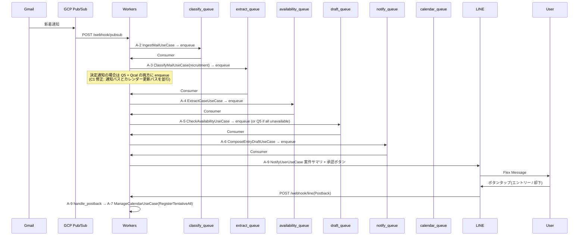
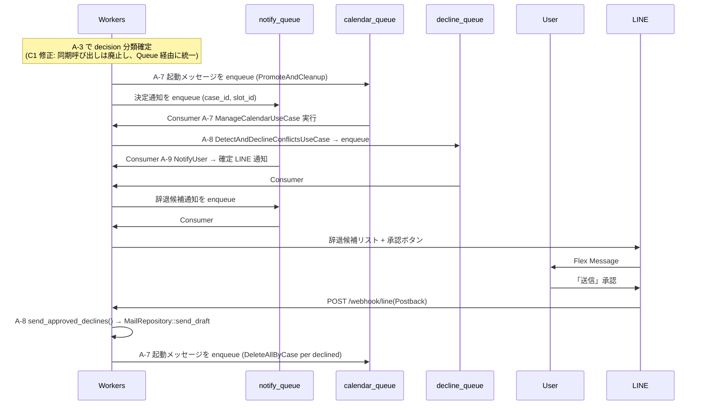
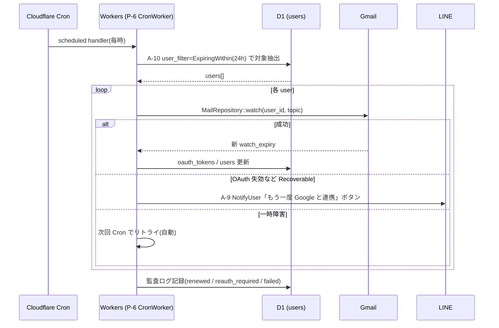

# Services — auto-mc-operation

サービス層(`crates/application` のユースケース群)のオーケストレーションパターン。**Q2=A: ステップ別 Queue + Q7=A: eventually consistent / saga** に基づく。

## 1. サービス層の構成

「サービス」= `crates/application` のユースケース。すべて以下の制約に従う:

- 単一の入力コマンド型 → 単一の Result
- ドメイン層トレイトのみに依存(`infrastructure` は DI で注入)
- D1 トランザクションは **ユースケース内で完結**(またぎ禁止)
- 失敗時は **`DomainError`** を返し、上位(Queue Consumer / HTTP Handler)で次アクションを決定
- 補償操作(saga)は **別ユースケースを起動**(直接呼ばず Queue 経由)

## 2. メイン業務フロー(Saga)

メール受信から確定 / 辞退までのエンドツーエンドフロー。各ステップは **独立した Queue + Consumer** で処理される。

決定連絡受信時:

## 3. Queue 構成(Q2=A: ステップ別)

| Queue 名 | Producer | Consumer Use Case | DLQ |
|----------|----------|-------------------|-----|
| `classify_queue` | A-2 IngestMail / 再投入 (admin) | A-3 ClassifyMail | `classify_dlq` |
| `extract_queue` | A-3(label=recruitment) | A-4 ExtractCase | `extract_dlq` |
| `availability_queue` | A-4 | A-5 CheckAvailability | `availability_dlq` |
| `draft_queue` | A-5(verdict=Available) | A-6 ComposeEntryDraft | `draft_dlq` |
| `notify_queue` | A-3(label=decision) / A-5 / A-6 / A-7(完了通知) / A-8 | A-9 NotifyUser | `notify_dlq` |
| `calendar_queue` | A-3(label=decision)/ A-9 Postback / A-8 (辞退送信完了後) | A-7 ManageCalendar | `calendar_dlq` |
| `decline_queue` | A-7 PromoteAndCleanup 完了後 | A-8 DetectAndDecline | `decline_dlq` |

**A-3(label=decision)受信時の方針**(C1 修正で統一):
- A-3 の Consumer は **`notify_queue` と `calendar_queue` の両方に enqueue** する(同期呼び出しは廃止)
  - `notify_queue` → A-9 NotifyUser でユーザーに「🎉 決定」LINE 通知
  - `calendar_queue` → A-7 ManageCalendar(PromoteAndCleanup)でカレンダー [仮]→[確定]更新 + 他候補削除
- 両者は独立した Queue なので **片方失敗・他方成功** が起こりうる。Saga 補償(セクション 4)で扱う

各 DLQ は F-14 で監視・運用者通知対象。

## 4. Saga 補償パターン

**例: ExtractCase 成功 → CheckAvailability で OAuth 失効発覚した場合**

| ステップ | 状態 | 補償 |
|---------|-----|------|
| A-2 IngestMail | ✅ Done | — |
| A-3 ClassifyMail | ✅ Done | — |
| A-4 ExtractCase | ✅ Done(case 保存済) | — |
| A-5 CheckAvailability | ❌ Failed(`Recoverable`) | ① `cases.status = pending_user_action` に設定 ② A-9 経由で「再連携」ボタン通知 ③ ユーザー再認可後、A-5 を再実行(`availability_queue` に再投入) |

**例: A-6 で Gmail 下書き作成失敗(`Transient`)**

| 動作 | 内容 |
|------|------|
| 自動リトライ | Queues の機構で 3 回まで指数バックオフ |
| 失敗確定後 | DLQ 移送 → 運用者通知(LINE)→ ユーザーには A-9 で「下書き作成失敗、再試行 / 手動 / 後ほど」ボタン |
| 復旧 | 運用者が原因解消 → 管理 API から `draft_queue` に再投入 |

## 5. ユースケース間の同期/非同期

Q7=A により基本は **すべて非同期 + Queue 経由**。例外として **同一トランザクション境界が必要な操作** は同期呼び出し:

| 元 | 先 | 同期/非同期 | 理由 |
|----|----|-----------|------|
| A-3 | A-4 | 非同期(`extract_queue`) | LLM 呼び出し時間が長い、独立リトライ |
| A-4 | A-5 | 非同期(`availability_queue`) | Calendar API 失敗時の独立復旧 |
| A-5 | A-6 | 非同期(`draft_queue`) | 同上 |
| A-6 | A-9 | 非同期(`notify_queue`) | 通知失敗時の独立リトライ |
| A-9(Postback) | A-7 | **同期**(直接呼ばず内部関数) | ユーザー承認直後の即時反映 |
| A-7 | A-8 | 非同期(`decline_queue`) | 辞退検出は時間がかかるため切り離す |
| A-3(decision)| A-7 | 非同期(`calendar_queue`) | C1 修正: 同期呼び出しを廃止し Queue 経由に統一 |
| A-3(decision)| A-9 | 非同期(`notify_queue`) | カレンダー更新と通知を並行実行 |
| Cron | A-10 | 同期(関数呼び出し) | A-10 RotateGmailWatch、Queue 不使用 |

## 5.1 Cron 起動シーケンス(A-10 RotateGmailWatch)

A-10 は Queue を使わない同期処理。Cron Triggers から直接起動する。

## 6. 共通サービス(横断的関心事)

`crates/application` 配下に補助サービス:

| サービス | 責務 |
|---------|------|
| `IdempotencyService` | KV 経由の冪等性キー管理(全ユースケースで利用、U1-EC-02) |
| `CompensationService` | saga 補償操作のオーケストレーション(エラーカテゴリ別の reroute) |
| `EventPublisher` | ドメインイベントを Queue に発行する標準インタフェース |

## 7. テスト戦略との接続(Q8=A)

- 各ユースケースは **D-15〜D-18 ポートにのみ依存** するため、`Mock*` 実装を注入してユニットテスト可能
- Queue 経由の連携は **結合テスト**で `MockQueueProducer` を使い、enqueue されたメッセージの内容を検証
- E2E テストは Miniflare + WireMock(Anthropic / Google / LINE のモック)で実行

詳細なエラーカテゴリ毎の補償ロジック・閾値・タイムアウト値は **Functional Design ステージ(per-unit)** で確定。
