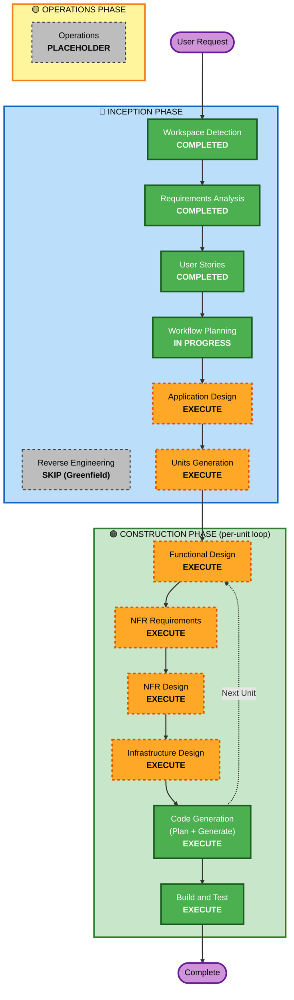

# Execution Plan — auto-mc-operation

## 1. プロジェクト前提
- **プロジェクト**: MC・コンパニオン エントリー業務自動化システム
- **タイプ**: Greenfield(新規開発)
- **言語/プラットフォーム**: Rust + Cloudflare Workers (workers-rs) → 拡張時 GCP Cloud Run
- **MVP スコープ**: F1〜F5 + F6/F7 部分(分類 / 抽出 / 空き確認 / エントリー下書き / LINE 通知 / カレンダー管理 / 辞退連絡 半自動)
- **Story 規模**: 58 Story(Foundation 14 + MVP Use Case 1〜7 = 44 / Phase 2 概略 8)
- **拡張機能**: Security Baseline + Property-Based Testing 双方 強制(blocking)

---

## 2. Detailed Analysis Summary

### 2.1 Change Impact Assessment
| 観点 | 影響 | 内容 |
|------|------|------|
| **User-facing changes** | ✅ Yes | プライマリペルソナ 2 名(P1: AI慣れ MC / P2: AI 未経験 MC)向けの LINE Bot UI を新設、Gmail 下書き連携 |
| **Structural changes** | ✅ Yes | DDD レイヤ(domain / application / infrastructure / presentation / shared)を一から構築 |
| **Data model changes** | ✅ Yes | D1 スキーマ(users / messages / cases / schedules / entries / calendar_events / drafts / pr_corpus / decline_corpus / consents / audit_logs / office_patterns / classification_rules)を新規定義 |
| **API changes** | ✅ Yes | LINE Webhook / Pub/Sub Push / OAuth Callback / 管理 API のエンドポイント設計 |
| **NFR impact** | ✅ Yes | レイテンシ 5 分 / スケール 100,000 件/日 / コスト 500円/ユーザー/月 / Security Baseline + PBT 強制 |

### 2.2 リスク評価

| 項目 | レベル | 理由 |
|------|--------|------|
| **リスクレベル** | **Medium〜High** | 外部 API 4 種(Gmail / Calendar / LINE / Anthropic)依存、LLM コスト管理が必要、SaaS 拡張前提 |
| **ロールバック複雑度** | **Easy〜Moderate** | Wrangler のバージョン管理で Workers ロールバック容易、D1 マイグレーションは慎重に逆方向移行を設計 |
| **テスト複雑度** | **Complex** | PBT + 結合 + E2E + LLM 評価ハーネス、Goldfn セット運用、ゴールデンテスト + プロパティベース |

### 2.3 主要技術リスクと緩和策

| リスク | 緩和策 |
|--------|--------|
| Anthropic API コスト超過(¥500/月目標) | F-05 二段分類(ルールベース → Haiku)、U2-00 プロンプトキャッシュ、ルール allowlist 自動拡張 |
| OAuth トークン漏洩 / 失効 | F-09 シークレット管理、AES-256-GCM、F-03 自動再認可フロー |
| DLQ 滞留による業務停止 | U1-EC-01 復旧フロー文書化、F-14 アラート設定 |
| プライベートカレンダー情報漏洩 | U3-04 freeBusy.query 限定、本サービス作成イベント以外は詳細取得しない |
| Cloudflare 障害 / API 仕様変更 | F-11 抽象化レイヤで Phase 3 に GCP Cloud Run 移行可能 |

---

## 3. Workflow Visualization



---

## 4. Phases to Execute

### 🔵 INCEPTION PHASE

- [x] **Workspace Detection** — COMPLETED
- [ ] ~~Reverse Engineering~~ — **SKIP**
  - **Rationale**: Greenfield プロジェクトのため対象なし
- [x] **Requirements Analysis** — COMPLETED(2 ラウンドのレビュー対応 + 月額500円目標 / 複数日程対応 等の追加反映済み)
- [x] **User Stories** — COMPLETED(58 Story、レビュー 6 ラウンドで Foundation / Use Case 1〜7 を詳細化、Phase 2 概略あり)
- [x] **Workflow Planning** — IN PROGRESS(本ドキュメント)
- [ ] **Application Design** — **EXECUTE**
  - **Rationale**: 新規コンポーネント多数(F-01〜F-14 の 14 Foundation Story が示すサブシステム)、DDD レイヤ別の責務・トレイト定義・コンポーネント間相互作用を明確化する必要。Mermaid で C4 Context / Container 図、コンポーネント責務、API エンドポイント設計、データモデル(D1 スキーマ)を確定
- [ ] **Units Generation** — **EXECUTE**
  - **Rationale**: 58 Story を Construction フェーズで処理しやすいユニットに分解。**ユニット候補**: Unit-1: Foundation 基盤 / Unit-2: メール取込・分類(F1)/ Unit-3: 案件抽出(F2)/ Unit-4: カレンダー連携(F3+F6)/ Unit-5: エントリー下書き + 学習データ(F4)/ Unit-6: LINE 通知 + 半自動承認(F5+F7)/ Unit-7: 監視・運用(F-13/F-14)。各ユニットを Construction の per-unit loop で順次処理

### 🟢 CONSTRUCTION PHASE(per-unit loop)

各ユニットに対して以下を実施:

- [ ] **Functional Design** — **EXECUTE**(ユニット毎に判断、複雑なユニットのみ実施)
  - **Rationale**: 複雑なビジネスロジック(重複判定アルゴリズム / LLM 抽出スキーマ / PR 文・辞退メール生成 / カレンダー状態遷移)の詳細設計が必要。Foundation 基盤(Unit-1)は本ステージのスコープが軽い可能性
- [ ] **NFR Requirements** — **EXECUTE**(ユニット毎)
  - **Rationale**: Security Baseline + PBT 拡張が **強制**(blocking)、NFR-1 レイテンシ / NFR-7 コストの達成方法を各ユニットで具体化
- [ ] **NFR Design** — **EXECUTE**(ユニット毎)
  - **Rationale**: SECURITY-01〜18 のうち各ユニットに該当するルールの実装パターン、PBT 対象の特定(F-13 で枠組み済み)
- [ ] **Infrastructure Design** — **EXECUTE**(ユニット毎、特に Foundation / メール取込 / 通知)
  - **Rationale**: Cloudflare 3 環境 / Wrangler 設定 / D1 マイグレーション / Queues / Cron / Durable Objects / Pub/Sub / DNS の具体設計
- [ ] **Code Generation** — **EXECUTE**(ALWAYS、ユニット毎)
  - **Rationale**: Rust 実装、Cloudflare Workers デプロイまでを各ユニットで実施
- [ ] **Build and Test** — **EXECUTE**(ALWAYS、全ユニット完了後に統合)
  - **Rationale**: ユニット単体テスト・統合テスト・E2E テスト・LLM 評価ハーネスの実行

### 🟡 OPERATIONS PHASE

- [ ] **Operations** — **PLACEHOLDER**
  - **Rationale**: 現時点ではプレースホルダー。Construction の Build and Test 内で監視・デプロイ手順は整備済み

---

## 5. Module Update Strategy(Greenfield のため簡略)

### Unit 実行順序(推奨)

```
Unit-1: Foundation 基盤
  └─ F-01 / F-02 / F-09 / F-10 / F-08 / F-11 / F-12 / F-13 / F-14
  ↓ (基盤完成後)
Unit-2: メール取込・分類(F1)
  └─ F-03 OAuth / F-04 LINE / F-05 Anthropic / F-06 ロギング / F-07 同意
  └─ U1-01〜U1-EC-03(分類パイプライン)
  ↓
Unit-3: 案件抽出(F2)
  └─ U2-00 プロンプト設計 / U2-01〜U2-EC-04
  ↓
Unit-4: カレンダー連携(F3 + F6)
  └─ U3-01〜U3-EC-01(空き確認)
  └─ U6-01〜U6-EC-01(カレンダー管理)
  ↓
Unit-5: エントリー下書き + 学習データ(F4)
  └─ U4-01〜U4-EC-02
  ↓
Unit-6: LINE 通知 + 半自動承認(F5 + F7)
  └─ U5-01〜U5-EC-01(通知)
  └─ U7-01〜U7-EC-01(辞退連絡)
  ↓
Unit-7: 監視・運用ハードニング
  └─ F-13 / F-14 を本格稼働させる
```

**並列化機会**: Unit-3〜Unit-6 は Unit-2 完了後に **部分的に並列開発可能**(各ユニットが Foundation の同じ抽象を使うため疎結合)

**Critical Path**: Unit-1 → Unit-2 → Unit-3, 4, 5, 6 → Unit-7

---

## 6. Estimated Timeline

- **総ステージ数**: INCEPTION 残り 2(Application Design / Units Generation)+ CONSTRUCTION 6 × 7 ユニット相当 + Build and Test 1 = 約 45 ステージ
- **推定期間**: 1 ユーザー(開発者本人 + AI コーディングエージェント)で MVP まで **2〜4 ヶ月**(ユニットを並列処理する前提)
- **MVP リリース**: Unit-7 完了 + Build and Test グリーン

---

## 7. Success Criteria

### Primary Goal
**MC / コンパニオン本人(プライマリペルソナ P1, P2)が** Gmail に届いた案件募集メールを **5 分以内** に LINE で受け取り、**ボタンタップだけ** でエントリー下書き保存・カレンダー仮登録・辞退連絡半自動 までを完了できる

### Key Deliverables
1. Cloudflare Workers にデプロイされた MVP(F1〜F5 + F6 部分 + F7 部分)
2. 58 Story すべてに対応する受入テスト(Given-When-Then)が CI で全グリーン
3. SECURITY-01〜18 + PBT 拡張ルールが CI で強制されている
4. `docs/` 配下に運用文書一式(architecture / environments / cloudflare-cost / secrets-management / messaging-conventions / system-overview / api-design / test-strategy / observability / operations)
5. P2 ペルソナ向けの **専門用語ゼロ・ボタンのみ操作** UX が実現

### Quality Gates
- ✅ NFR-1: メール受信 → LINE 通知 P95 < 5 分
- ✅ NFR-7: 月額コスト/ユーザー が 500 円目標の範囲内
- ✅ NFR-3: 可用性 99.0%(MVP)
- ✅ NFR-4: Security Baseline 全 SECURITY ルール準拠(blocking)
- ✅ NFR-6: PBT カバレッジ + ゴールデンセット F1 スコア閾値達成

---

## 8. 次のステージ

**Application Design** へ進行(承認後)。コンポーネント図 + サービス層 + データモデル + API 設計を `aidlc-docs/inception/application-design/` 配下に作成します。
